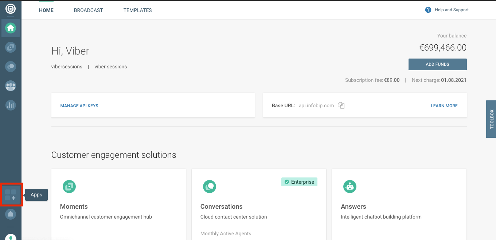
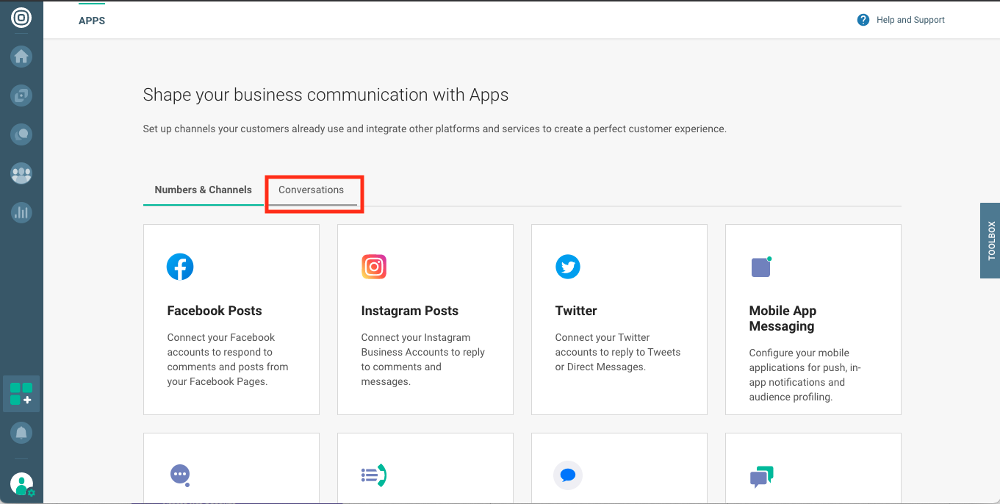
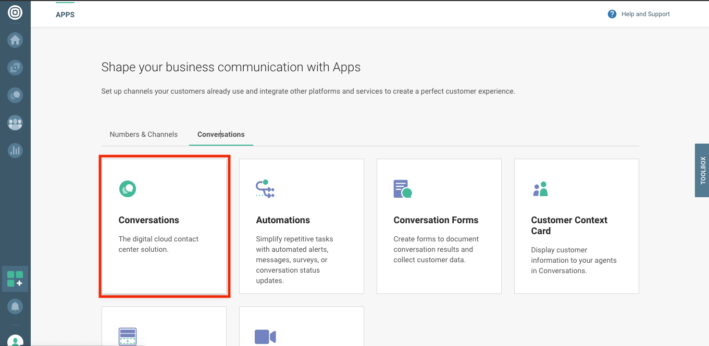
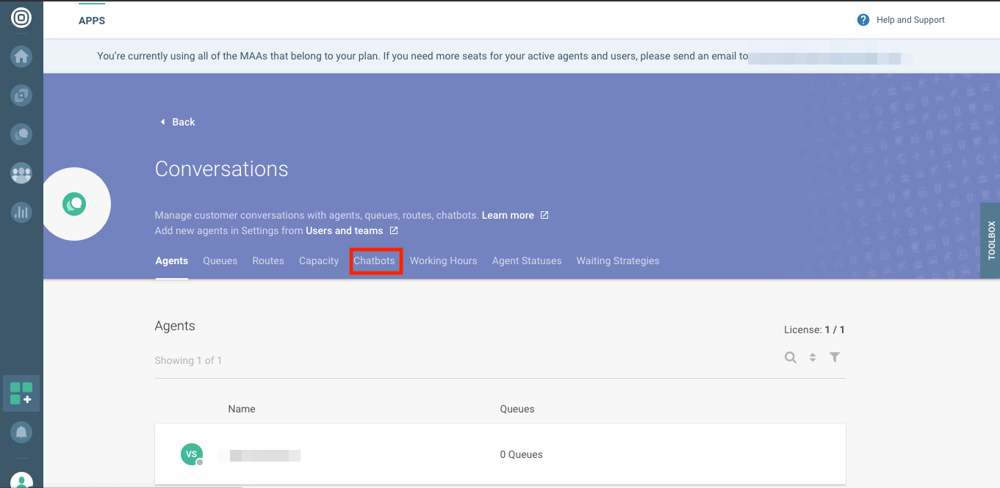
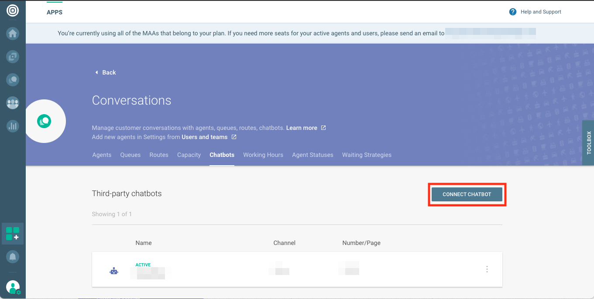
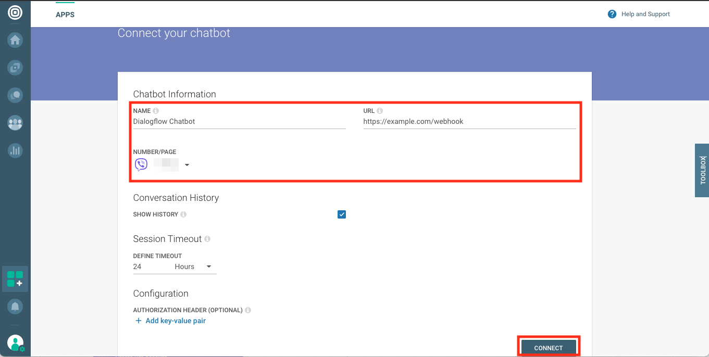
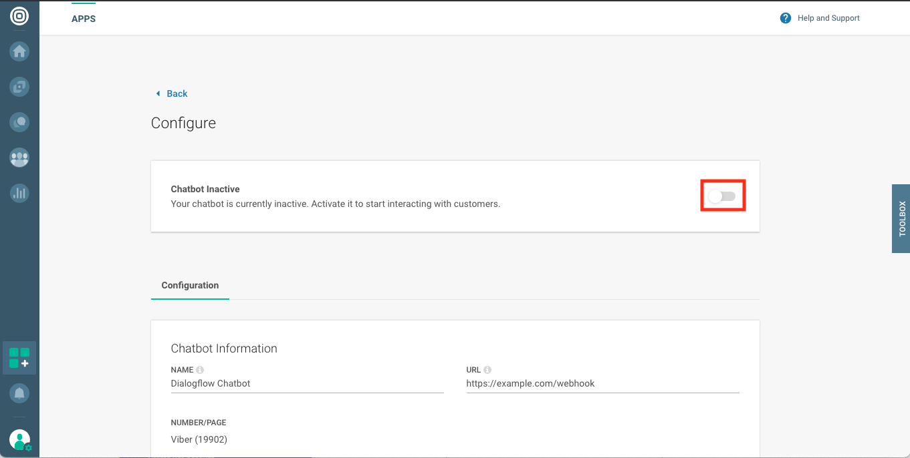

# Dialogflow Integration

## Introduction

The purpose of this documentation is to set up an integration deployment to connect your existing Dialogflow agent to various third party chat service platforms.

If you do not have an existing Dialogflow agent, you can set one up by reading the documentation [here](https://cloud.google.com/dialogflow/docs/).

Although it is possible to set up this integration deployment on any hosting platform, these instructions will use [Google's Cloud Run](https://cloud.google.com/run/).

## Prerequisites
You need to have [Infobip](https://infobip.com) account with [Conversations](https://www.infobip.com/docs/conversations).

## Initial GCP Setup

### Setting up gcloud CLI

The deployment process for GCP Cloud Run via this README utilizes gcloud CLI commands. Follow the steps below to set up gcloud CLI locally for this deployment.

1. On the gcloud CLI [documentation page](https://cloud.google.com/sdk/docs/quickstarts), select your OS and follow the instructions for the installation. 
2. Run ``gcloud config get-value project`` to check the GCP Project configured. 
3. Go into the Dialogflow agent’s settings and check the Project ID associated with the agent. The GCP Project configured in the gcloud CLI should match the agent’s Project ID.
4. If the project IDs do not match, run ``gcloud config set project PROJECT-ID``, replacing PROJECT-ID with the Project ID from step 3. 

### Service Account Setup (GCP)

For the integration to function properly, it is necessary to create a Service Account in your agent’s GCP Project. See [this page](https://cloud.google.com/dialogflow/docs/quick/setup#sa-create) of the documentation for more details. 

Follow the steps below to create a Service Account and set up the integration. 

1. Go into the Dialogflow agent’s settings and click on the Project ID link to open its associated GCP Project.
2. Click on the navigation menu in the GCP console, hover over "IAM & admin", and click "Service accounts". 
3. Click on "+ CREATE SERVICE ACCOUNT", fill in the details, and give it the "Dialogflow Client API" role.
4. Click on "+ Create Key" and download the resulting JSON key file. 
5. Save the JSON key file in the desired platform subdirectory. 

If deploying this integration outside of GCP Cloud Run, it may be necessary to set the GOOGLE_APPLICATION_CREDENTIALS environmental variable on the deployment environment to the absolute path of Service Account JSON key file. See [this guide](https://cloud.google.com/dialogflow/docs/quick/setup#auth) for details.

<a name="InitialInfobipConversationsSetup"></a>
## Initial Infobip Conversations setup
- Log in to [Infobip's Customer Portal](https://portal.infobip.com)
- Navigate to "apps"

- Switch to "Conversations" tab

- Choose "Conversations"

- Choose "Chatbots"

- Click "Connect Chatbot" button

<a name="ProvideChatbotDetails"></a>
- Provide chatbot details (name, webhook URL and number/page) and click "Connect" button

  As URL you need to provide address of webhook exposed by your app. In case you don't know it yet, please provide placeholder and edit that after app is deployed.
  To be able to edit URL, external bot needs to be inactive state.

- Activate your chatbot

- Make note of your chatbot ID. You'll need it later when configuring chatbot app 


## Deploying the Integration

### Integration setup

1. Go into the Dialogflow agent’s settings and click on the Project ID link to open its associated GCP Project.
2. Click on the navigation menu in the GCP console and click "Billing". Set up and enable billing for the project. 
3. Enable Cloud Build and Cloud Run API for the project
[here](https://console.cloud.google.com/flows/enableapi?apiid=cloudbuild.googleapis.com,run.googleapis.com).
4. Clone this git repository onto your local machine or development environment:
`git clone [repository url]`
5. Open the root directory of the repository on your local machine or development environment and copy Service Account JSON key file there. 
6. Provide configuration values
Provide values for the following variables inside of `src/configuration_provider.js` file.
Alternatively you can provide environment variables for your container.

| Variable       | Environment variable           | Description |
|---             |---                             |---	|
| project        | DIALOGFLOW_PROJECT             | ID of GCP project running Dialogflow |
| agentId        | DIALOGFLOW_AGENT_ID            | ID of Dialogflow Agent |
| agentLocation  | DIALOGFLOW_AGENT_LOCATION      | Location where Dialogflow agent is deployed |
| infobipBaseUrl | INFOBIP_BASE_URL               | You need to provide base URL as listed on https://portal.infobip.com homepage. |
| infobipApiKey  | INFOBIP_API_KEY                | To authenticate when sending messages to Infobip. More on https://portal.infobip.com/settings/accounts/api-keys |
| language       | BOT_LANGUAGE                   | Language used when processing content on Dialogflow side |
| infobipBotId   | INFOBIP_BOT_ID                 | ID of the external bot configured in Conversations |

### Deploying the Integration Using Cloud Run

In your local terminal, change the active directory to the repository’s root directory.

Run the following command to save the state of your repository into [GCP Container Registry](https://console.cloud.google.com/gcr/). Replace PROJECT-ID with your agent’s GCP Project ID and PLATFORM with the platform subdirectory name.

```shell
gcloud builds submit --tag gcr.io/PROJECT-ID/dialogflow-PLATFORM
```

Deploy your integration to live using the following command. Replace PROJECT-ID with your agent’s GCP project Id, PLATFORM with the platform subdirectory name, and YOUR_KEY_FILE with the name (not path) of your Service Account JSON key file.

```shell
gcloud beta run deploy --image gcr.io/PROJECT-ID/dialogflow-PLATFORM --update-env-vars GOOGLE_APPLICATION_CREDENTIALS=YOUR_KEY_FILE --memory 1Gi
```

- When prompted for a target platform, select a platform by entering the corresponding number (for example, ``1`` for ``Cloud Run (fully managed)``).
- When prompted for a region, select a region (for example, ``us-central1``).
- When prompted for a service name hit enter to accept the default.
- When prompted to allow unauthenticated invocations press ``y``.
- Copy the URL given to you, and use it according to the README file in the given integration's folder.

Take the value for the server URL printed in the console after the completion of the execution of the above command and configure it chatbot's URL on [Provide chatbot details](#ProvideChatbotDetails) screen in Conversations.

Redeploy the integration with the updated change by rerunning the above two commands. 

More information can be found in Cloud Run
[documentation](https://cloud.google.com/run/docs/deploying).

You can view a list of your active integration deployments under [Cloud Run](https://console.cloud.google.com/run) in the GCP Console.

## Post-deployment

### Shutting Down an Integration

In order to shut down an integration set up via the steps in this README, only deleting the Cloud Run service is required.

In your local terminal, run the following command and select the previously chosen target platform to list active deployments:

```shell
gcloud beta run services list
```

Then run the following command, replacing SERVICE-NAME with the name of the service you want to shut down, and select the same settings chosen when deploying in order to shut down the deployment. 

```shell
gcloud beta run services delete SERVICE-NAME
```

If following the instructions closely, SERVICE-NAME should be in the format of dialogflow-PLATFORM

### Changing Integration Behavior

The behavior of an integration can be customized via the addition of your own developer code or by editing the files in src/ directory.

After making changes, redeploy the deployment by re-running the commands as specified in the "Deploy the Integration Using Cloud Run" section of the platform-specific integration READMEs.
