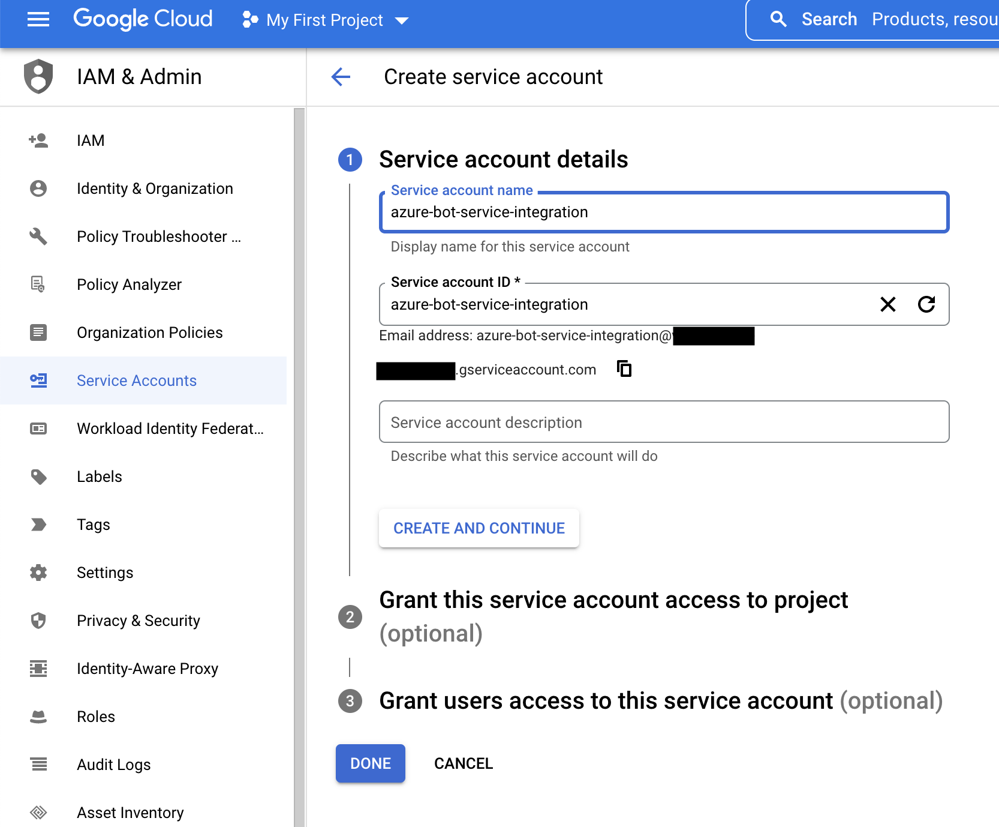
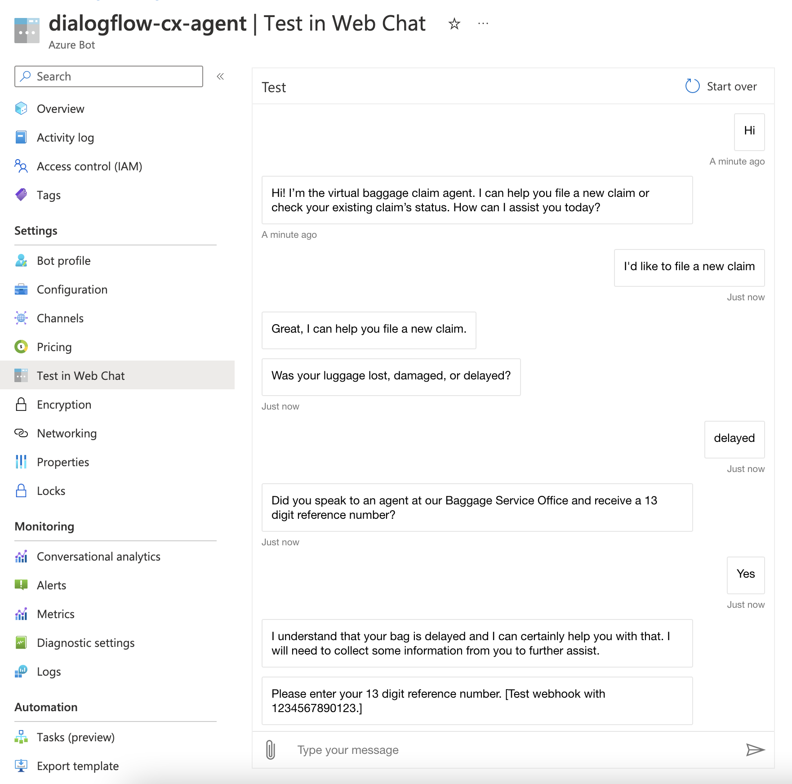
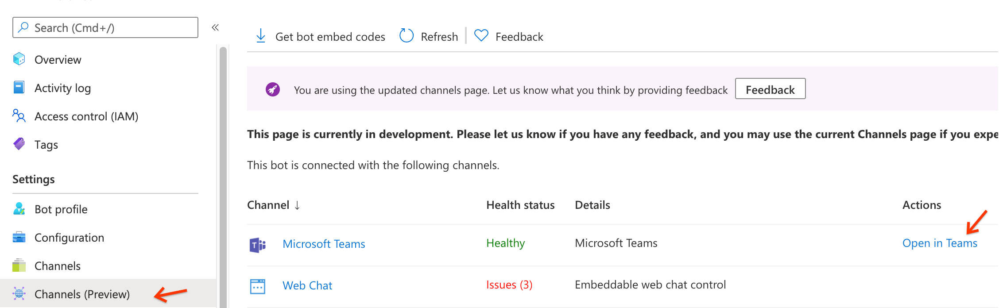

# Integrating Dialogflow CX with Azure Bot Service & Microsoft Teams

Microsoft Azure Bot Service is a platform developers can use to integrate Microsoft Teams and other Azure channels with third party conversational platforms like Dialogflow. 

The example belows shows how to integrate a Dialogflow CX Agent with Azure Bot Services and enable the Microsoft Teams channel.

<br><br>

## Prerequisites
- GCP Project that contains a working Dialogflow CX Agent. To easily demonstrate the integration, we use a [Dialogflow Prebuilt Agent](https://cloud.google.com/dialogflow/cx/docs/concept/agents-prebuilt).

<br>

## First, create an Azure Bot using Azure Bot Services

1. If you don't already have a paid Microsoft 365 Subscription, create a free [Microsoft 365 Developer Account](https://developer.microsoft.com/en-us/microsoft-365/dev-program) and use this account to log into the [Azure Portal](https://azure.microsoft.com/en-us/features/azure-portal/). Testing the Microsoft Teams channel requires a 365 developer account or paid 365 subscription.

2. In the Azure Portal, navigate to **Bot Services** and create a new **Azure Bot**.
<br><br>
<br><br>

3. Fill in the details for your new Azure Bot. Create a unique name for your bot, and create a new resource group. This example will work if you change the Pricing Tier to **Free**. Select **Multi Tenant** as the Type of Application and click the radio button for **Create a New Microsoft App ID**.
<br><br>
<br><br>

4. Once deployed, navigate to your new Azure Bot resource and click on **Configuration** under Settings. Copy the Microsoft App Id for use later as the MICROSOFT_APP_ID environment variable. Then click on **Manage** and create a **new client secret**. Copy the **Value** of the new secret you created for use in the next step. The client secrect is the value you should use for the environment variable MICROSOFT_APP_PASSWORD in the steps below.
<br><br>
<br><br>

<br>

## Second, create a Google Cloud service account for the Dialogflow Webhook

1. Open the Google Cloud Console and navigate to the project that contains your Dialogflow CX agent.

2. Navigate to **IAM & admin > Service Accounts** from the navigation menu in the GCP console. Click on **+ CREATE SERVICE ACCOUNT**, fill in the details, and give it the **Dialogflow API Client** role. Copy the service account email address for use in the next step.
<br><br>
<br><br>

<br>

## Next, deploy a Cloud Function Webhook on Google Cloud

In this step, you'll deploy a serverless webhook using NodeJs & Cloud Functions on Google Cloud that will act as an integration service between Dialogflow CX and Azure Bot Service. This example demonstrates using Google Cloud Functions to deploy the webhook. Google Cloud offers other servless compute products that could be used in place of Cloud Functions depending on your specific requirements. Cloud Functions is the simplest service to get started with.

The next steps require a code editor and command line, as well as the [gcloud CLI](https://cloud.google.com/sdk/docs/install). [Cloud Shell Editor & Cloud Shell Terminal](https://cloud.google.com/shell) is a great tool for this next step.

1. Clone this repository and navigate to the folder dialogflow-integrations/azure-bot-service.
```
git clone https://github.com/GoogleCloudPlatform/dialogflow-integrations.git

cd dialogflow-integrations/cx/azure-bot-service
```

2. Use a code editor to open **.env** and update the following environment variables with the values you captured above. You may need to configure your code editior to view hidden files. The **Agent Id** can be found by navigating to the Dialogflow CX console and locating the **Agent Link** for the agent you would like to link to Azure Bot Service. It will be the UUID that follows **agents** in the URL: https://dialogflow.cloud.google.com/cx/projects/your-project-id/locations/us-central1/agents/**your-agent-uuid**. Additionally, the **LOCATION** and **DIALOGFLOW_ENDPOINT** must correspond to the same region and the list of service endpoints can be found [here](https://cloud.google.com/dialogflow/cx/docs/reference/rest/v3-overview).

<br><br>

3. Run the following commands to deploy the Dialogflow messaging endpoint to Cloud Functions. Enter **Y** when prompted to **Allow unathenticated invocations of new functions**. Authentication is handled inside the webhook and additional information on Security Considerations is included towards the end of this documentation.
```
SERVICE_ACCOUNT=your-gcp-service-account-email-address

gcloud functions deploy dialogflow-azure-webhook --entry-point app --runtime nodejs12 --service-account=$SERVICE_ACCOUNT --trigger-http
```

4. Copy the HTTP Trigger URL. It will look something like this: https://us-central1-project-id.cloudfunctions.net/dialogflow-azure-webhook.

<br>

## Finally, complete Azure Bot Configuration and Test

1. Finally, take the service url you copied from the prior section and paste it in the **Messaging endpoint** field of your Azure Bot configuration and click **Apply**.
<br><br>

2. Click on **Test in Web Chat** to quickly test your Azure Bot Service and Dialogflow Integration.
<br><br>

3. To test basic Microsoft Teams Integration, click on Channels and follow the prompts to turn on Microsoft Teams integration. You'll then see an option to open a chat with your bot from within the Teams App, and you are able to use the Teams Web App. View additional information on Microsoft Teams integration with Azure Bot Services [here](https://docs.microsoft.com/en-us/azure/bot-service/channel-connect-teams?view=azure-bot-service-4.0).
<br><br>
<br><br>

<br>

## Enabling and testing Skype integration

1. Navigate to Channels in your Azure bot and click **Add to Skype**.
<br><br>

2. Select **Add to Contacts**. If prompted, sign in and add to contacts again. 
<br><br>

3. Log into skype using the same account and see the agent as a new contact. You can now communicate with your Dialogflow agent. 
<br><br>

<br>

## Security Considerations

Within this solution there are 2 types of authentication to consider: bot authentication & user authentication.

### Bot Authentication

When configuring Azure Bot Service, a Microsoft App Id and App Password are used to authenticate the webhook deployed in Cloud Functions. The NodeJs Bot Framework Client Library validates each request sent to the webhook using a token in the header of each request. If the request header is malformed or the expected token isn't provided, a 403 error is returned. The security procedures implemented by the Bot Framework SDK are explained in detail [here](https://learn.microsoft.com/en-us/azure/bot-service/rest-api/bot-framework-rest-connector-authentication?view=azure-bot-service-4.0&tabs=multitenant#connector-to-bot).


### User Authentication

Azure Bot Service provides an Oauth 2.0 configuration for authenticating users within a chat session if this a requirement for your application. You are able to configure Azure Bot Service to authenticate a user and pass the user identity to the Dialogflow Webhook hosted on GCP. [Click here](https://learn.microsoft.com/en-us/azure/bot-service/bot-builder-concept-authentication?view=azure-bot-service-4.0) for more information about user authentication in Azure Bot Service.
