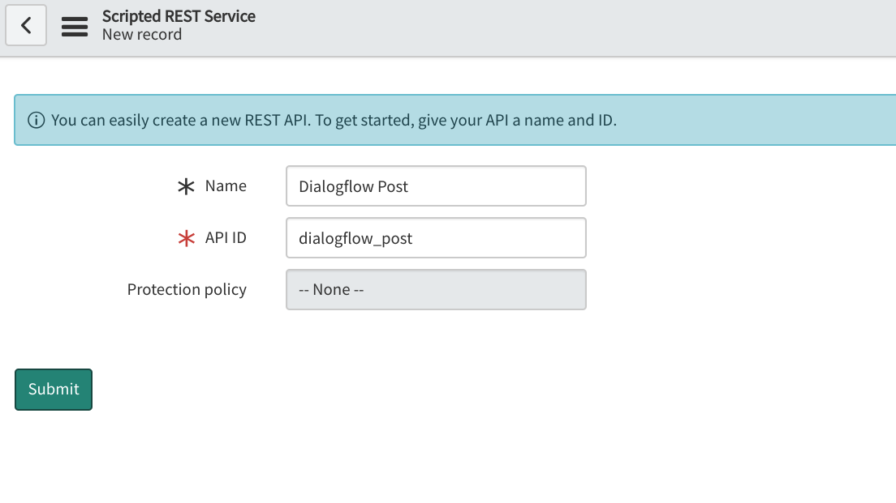
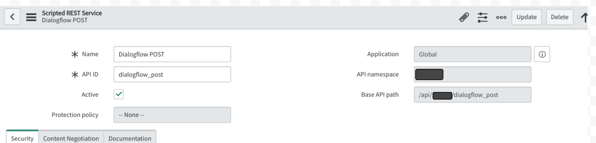
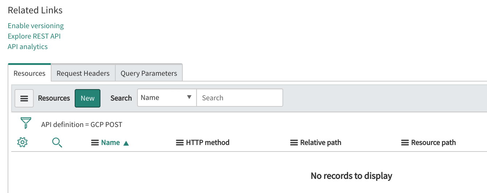
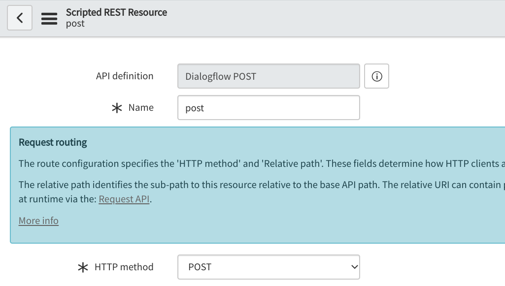
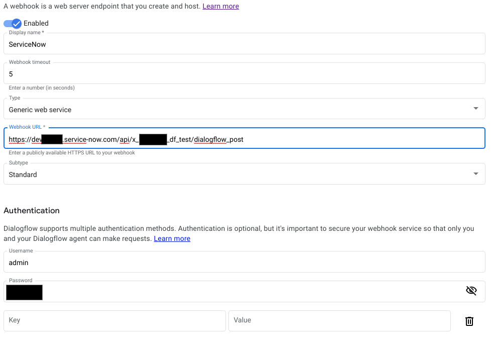
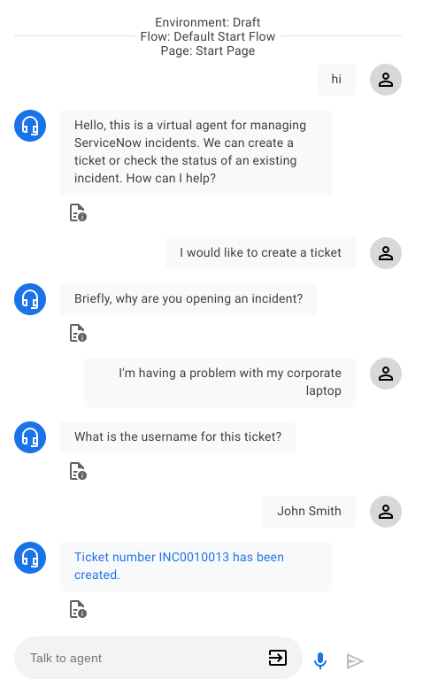
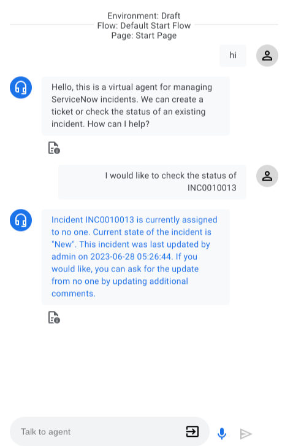
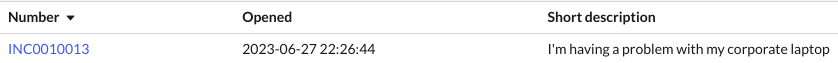

# ServiceNow Integration

This integration provides an example for managing incident reports with a Dialogflow CX agent by communicating with a ServiceNow webhook.

## ServiceNow Setup

### Prerequisites

* Create a [ServiceNow Developer account](https://developer.servicenow.com/dev.do).

### Configuring ServiceNow

* Log into your ServiceNow Developer account. If this is the first time you are logging in, you will need to create an _Instance_. Follow the instructions on creating an Instance and select a _Release_. As of this writing, Paris is the latest Release and it is recommended that you choose one of the latest releases, Orlando or Paris for this integration.
* Click on your Instance URL (ex. _https://dev10101.service-now.com/_) and log in. You will now be logged into the admin console.
* From the Navigation menu, search for `Scripted REST APIs` and select this option.
* From the **Scripted REST APIs menu**, click on the **New** button.
* Provide a descriptive name like `Dialogflow Post`. The API ID field will be automatically populated after you provide a name. Click on the **Submit** button.

* You will be returned to the **Scripted REST APIs** menu. From the list of Services, find and select the one you just created.
* **_Make a note of the “Base API path” as you will use this value to make your Dialogflow Webhook._**

* Scroll down the page and on the Resources tab, click on the **New** button.
 

* On the **Scripted REST Resource** page, provide a descriptive Name and in the **HTTP method** field, select **POST**.

 
* In the **Script** section, replace the code with the code in the file `servicenow.js` and then click the **Submit** button at the top.

## Configuring Dialogflow

### Import Dialogflow Agent

* Create the agent from the [Dialogflow Console](https://dialogflow.cloud.google.com/cx) by selecting **Create agent** and following the prompts and selecting **Create**.
* From the Dialogflow Console, select vertical dots next to the project you just created.
* Select **Restore**.
* Select the **Upload** radio option and upload the provided agent `servicenow-demo-agent.zip`.

### Webhook Configuration

* From the agent portal select **Manage**.
* Select **Webhooks** on the left menu.
* Select the provided webhook called _ServicewNow_.
* Fill the **Webhook URL** filed with your ServiceNow Developer Instance URL along with the **Base API Path** for the ServiceNow Scripted REST Service that you created in an earlier step.
* For _Authentication_, enter the username and password. **_Note_**: _In this example we use the Admin credentials for simplicity, but for more than a Sandbox, you would want to create a new user to make the web requests or better, configure OAuth tokens._

* Scroll down and click on the **Save** button.

### Testing the Integration

* You have now completed all the necessary steps and can test your integration in the **Test Agent** window.
* Try creating a ticket:

* Try checking on the status of a ticket:

* From the ServiceNow console Navigation menu, search for `incident` and click on **Open** for a list of all open tickets. Find the ticket you just created:

