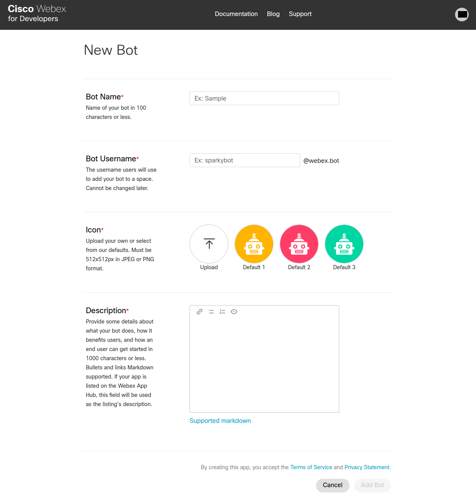

# Spark Integration for Dialogflow CX

## Setup

### Prerequisites

- Follow the instructions on the [main README file](https://github.com/GoogleCloudPlatform/dialogflow-integrations#readme) in the root directory of this repository.
- Create a [Spark account](https://teams.webex.com/signin).
-  Uncomment and fill in the variables on the top of the [server.js file](https://github.com/GoogleCloudPlatform/dialogflow-integrations/blob/9df026cdb76aeb2d664767ca36f5f84ca4cb71b6/cx/spark/server.js#L16).

### Creating a Spark Bot

- Log in to Spark and go to the [New Bot page](https://developer.webex.com/my-apps/new/bot).
- Fill in the required fields and click the "Add Bot" button. 



- On the next screen, take the value for your bot’s __access Token__ and replace the value for __sparkAccessToken__ in the [server.js file](https://github.com/GoogleCloudPlatform/dialogflow-integrations/blob/9df026cdb76aeb2d664767ca36f5f84ca4cb71b6/cx/spark/server.js#L17).

### Deploying the Integration Using Cloud Run

In your local terminal, change the active directory to the repository’s root directory.

Run the following command to save the state of your repository into [GCP Container Registry](https://console.cloud.google.com/gcr/). Replace PROJECT-ID with your agent’s GCP Project ID.

```shell
gcloud builds submit --tag gcr.io/PROJECT-ID/dialogflow-spark
```

Deploy your integration to Cloud Run using the following command. Replace `PROJECT_ID` with your agent’s GCP project Id, and `DIALOGFLOW_SERIVCE_ACCOUNT` with the Service Account which you acquired in the Service Account Setup step of the [main README file](../readme.md).

```shell
gcloud beta run deploy --image gcr.io/PROJECT_ID/dialogflow-spark --service-account DIALOGFLOW_SERVICE_ACCOUNT --memory 1Gi
```

- When prompted for a target platform, select a platform by entering the corresponding number (for example, ``1`` for ``Cloud Run (fully managed)``).
 - When prompted for a region, select a region (for example, ``us-central1``).
 - When prompted for a service name hit enter to accept the default,
 - When prompted to allow unauthenticated invocations press ``y``,
 - Copy the URL given to you, and use it according to the README file in the
 given integration's folder.

Take the value for the server URL printed in the console after the completion of the execution of the above command and replace the value for __targetUrl__ in the [server.js file](https://github.com/GoogleCloudPlatform/dialogflow-integrations/blob/9df026cdb76aeb2d664767ca36f5f84ca4cb71b6/cx/spark/server.js#L18). 

Redeploy the integration with the updated change by rerunning the above two commands. 

More information can be found in Cloud Run
[documentation](https://cloud.google.com/run/docs/deploying).

You can view a list of your active integration deployments under [Cloud Run](https://console.cloud.google.com/run) in the GCP Console.
