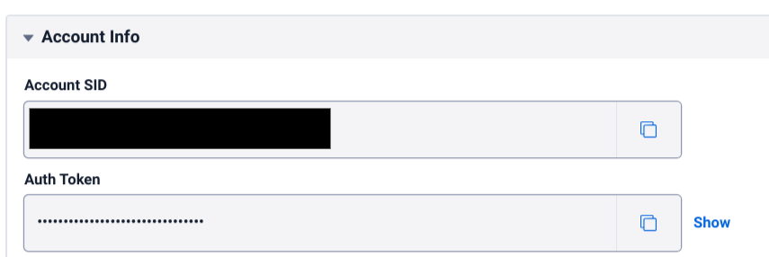
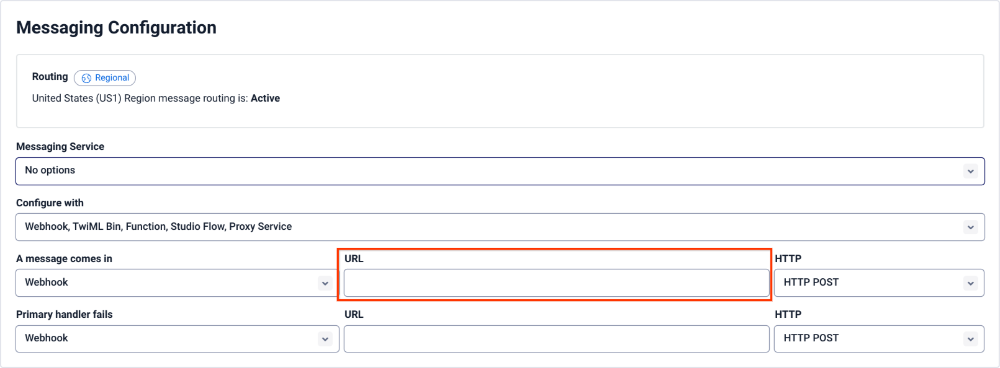

# Twilio (Text Messaging) Integration

## Setup

### Prerequisites

- Follow the instructions on the [main README file](https://github.com/GoogleCloudPlatform/dialogflow-integrations#readme) in the root directory of this repository.
- Create a [Twilio account](https://www.twilio.com/try-twilio).
- Copy and paste the following text into a new file titled __env__ created in the folder for this integration.
- Replace __PROJECT_ID__ with your Google Cloud project ID.
- Replace __AGENT_ID__ with your Dialogflow CX agent ID.
- Replace __LOCATION__ with your agent's location code, e.g. "us-central-1."
  
```TWILIO_ACCOUNT_SID = ''
TWILIO_AUTH_TOKEN = ''
PROJECT_ID = ''
LOCATION = ''
AGENT_ID = ''
LANGUAGE_CODE = ''
```
### Retrieving Credentials

1. Log in to the Twilio [Dashboard](https://www.twilio.com/console). 
2. Under the "Account Info" section, take the values for  __Account SID__ and __Auth Token__ and replace the value for __TWILIO_ACCOUNT_SID__ and __TWILIO_AUTH_TOKEN__ in the __.env__ file.



### Buying a Phone Number

1. Navigate to the Twilio console. 
2. Under the "Develop" tab, click "Manage," then "Phone Numbers". 
3. Click "Buy a Number. "Search for a number that has SMS capabilities and buy it. 


Additionally, all phone [10DLC numbers](https://support.twilio.com/hc/en-us/articles/360038173654-What-are-the-differences-between-long-codes-A2P-10DLC-short-codes-and-Toll-Free-numbers-for-messaging-to-US-Canada-) will need to be registered with Twilio. If this applies to you, follow [this guide](https://support.twilio.com/hc/en-us/articles/1260801864489-How-do-I-register-to-use-A2P-10DLC-messaging-) to register your new number. 

### Deploying the Integration Using Cloud Run

In your local terminal, change the active directory to the repository’s root directory.

Run the following command to save the state of your repository into [GCP Container Registry](https://console.cloud.google.com/gcr/). Replace PROJECT-ID with your agent’s GCP Project ID.

```shell
gcloud builds submit --tag gcr.io/PROJECT-ID/dialogflow-twilio
```

Deploy your integration to Cloud Run using the following command. Replace `PROJECT_ID` with your agent’s GCP project Id, and `DIALOGFLOW_SERIVCE_ACCOUNT` with the Service Account which you acquired in the Service Account Setup step of the [main README file](../readme.md).

```shell
gcloud beta run deploy --image gcr.io/PROJECT_ID/dialogflow-twilio --service-account DIALOGFLOW_SERVICE_ACCOUNT --memory 1Gi
```

- When prompted for a target platform, select a platform by entering the corresponding number (for example, ``1`` for ``Cloud Run (fully managed)``).
 - When prompted for a region, select a region (for example, ``us-central1``).
 - When prompted for a service name hit enter to accept the default.
 - When prompted to allow unauthenticated invocations press ``y``.
 - Copy the URL given to you, and use it according to the README file in the
 given integration's folder.

More information can be found in Cloud Run
[documentation](https://cloud.google.com/run/docs/deploying).

You can view a list of your active integration deployments under [Cloud Run](https://console.cloud.google.com/run) in the GCP Console.

### Setting up Phone Number

1. In the "Phone Number" section, go to [Active numbers](https://www.twilio.com/console/phone-numbers/incoming).
2. Click on the purchased number. 
3. Underneath "Messaging", take the value for the server URL printed in the console after the completion of the execution of the last command from the above section to the __"A message comes in"__ fill-in box. Set the first drop-down to __Webhook__ and the HTTP method to __HTTP POST__. 



### Complete

Now simply text the Twilio phone number you registered and your agent will respond. 

### WhatsApp Setup

This integration can be used as a webhook with Twilio to send WhatsApp messages.

1. Under **Messaging** and **Try it out**, select **Send a WhatsApp message**
2. Follow the prompts to join the sandbox
3. Select the **Sandbox settings** tab
4. Fill **When a message comes in** with the webhook URL given during deployment and select **POST** for the **Method**


5. Select **Save**
6. Send a message to your WhatsApp number to test the integration.
