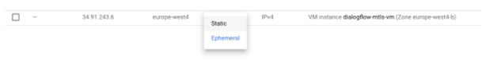
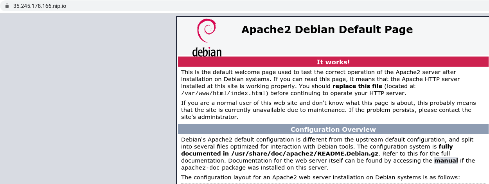

### **Mutual TLS authentication with Dialogflow**

**Create a Node.js VM on Compute Engine**

Create a Node JS VM with the following steps:

From the Cloud Console menu select:** Marketplace**

Choose **Node.js by Google Click to deploy image**


Select a region. Make sure HTTPS and  HTTPS is checked.

From the Cloud Console menu select:** VPC Network > Firewall > Create new firewall rule**

Targets**: All instances in network**

Source IP ranges**: 0.0.0.0/0**

Specified ports:** tcp > 3000**

Click** Create**


**Attach a domain name to your VM**

From the Cloud Console menu select:** VPC Networks > External IP addresses**

You should see your new VM instance. We will now reserve a static IP address so we can bind this later to a domain.

Select in the dropdown:** Static**





This will reserve a static IP address. Make a note of this address.

You will need a valid SSL certificate which was provided by a valid Certificate Authority. If not, Chrome and likely other applications, like Dialogflow will block your website, once your website is blocked Dialogflow can't reach your fulfillment URL, even when it's available on HTTPS.

We will make use of Certbot with Let's Encrypt, a free tool to get a free valid SSL certificate. However, you will need a domain name that you can attach to it. If you rather attach the certificate to an IP address, you could create a self signed certificate via openssl, however you will still need a valid Certificate Authority, which you will likely need to order. So instead we will go with the domain option.

Do you need a free domain for development?  

Then check out these options: nip.io or xip.io.

Once this is linked, we will go back to the Google Cloud console. 

From the Cloud Console menu select:** Compute Engine,**

and** SSH **into the newly created VM**.**

Once you are logged in, run this command on the command line to install Certbot:


```
sudo apt-get install certbot python-certbot-apache
```


Run this command to get a certificate and have Certbot edit your Apache configuration automatically to serve it, turning on HTTPS access in a single step.  (Note: Here is where you can specify your domain as **_External IP.nip.io_** (xx.xx.xx.xx.nip.io).


```
sudo certbot --apache
```


Restart the Apache server:


```
sudo /etc/init.d/apache2 restart
```


Now open a new browser tab, and test out your domain name. It should bring you to the default apache setup:





**Setup your Node application**


```
sudo mkdir /var/www/projects
sudo chown $USER /var/www/projects
cd /var/www/projects

nano index.js
```


Insert the code from the file “index.js”.


```
nano package.json
```


Insert the code from the file “package.json”. 

Install Node packages:


```
npm install
```


Start Node in the background:


```
node index.js &
```


We will have to enable the proxy modules:


```
sudo a2enmod proxy
sudo a2enmod proxy_http
```


Restart the Apache server:


```
sudo /etc/init.d/apache2 restart
```


Now let's modify the Apache configuration:


```
sudo nano /etc/apache2/sites-available/000-default-le-ssl.conf
```


Replace the code with the code from the file “000-default-le-ssl.conf”.  Be sure to replace the necessary variables for Server Name and with your Project Directory.

Run the following two commands to download the root CA which will be used by Dialogflow. This will add GTS101.crt and GSR2.crt to the local file: **ca-crt.pem**:


```
curl https://pki.goog/gsr2/GTS1O1.crt | openssl x509 -inform der >> ca-crt.pem
curl https://pki.goog/gsr2/GSR2.crt | openssl x509 -inform der >> ca-crt.pem
```


Restart the Apache server:


```
sudo /etc/init.d/apache2 restart
```


#### **Setup Dialogflow**

First, make sure that in Dialogflow, you are pointing to your new VM, from the **fulfillments** screen.


Second, make sure that in your “Default Welcome Intent” under _Responses_ is empty and _Fulfillment_ is enabled “Enable webhook call for this intent”.  We will call our Webhook to respond to the Welcome Intent.


Finally we can test in the “Try it now” section.  Say something like “hello” and see the response from the Node application: **_Welcome to my mTLS secured agent!_**


One final test.  Now that we specified to only allow requests from *.dialogflow.com, back in your browser, try to go directly to the domain and you should get an error message “ERR_BAD_SSL_CLIENT_AUTH_CERT”:


