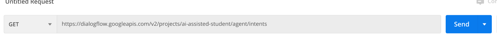
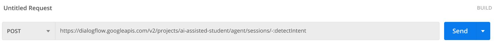
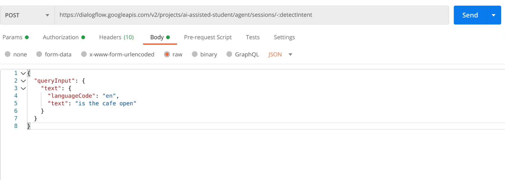

# **Query Dialogflow API using Postman**

## 
**Setup**

### 
**Prerequisites**

*   Download and launch [Postman](https://www.postman.com/).

**Generate an OAuth 2.0 token**

1. From the GCP console (APIs & Services -> Library), ensure that the **Dialogflow API** is enabled 
2. Create an OAuth 2.0 client ID
    *   From the GCP console (API & Services -> OAuth consent screen)
        *   Add “_getpostman.com_” to the Authorized domains. Click Save.
    *   From the GCP console (API & Services -> Credentials)
        *   Select _+Create Credentials_ -> OAuth client ID  and choose Application type ‘_Web application_’.
            *   Name: '**getpostman**'
            *   Authorized redirect URIs: **<code>https://www.getpostman.com/oauth2/callback</code></strong>
    *   Copy the generated <em>Client ID</em> and <em>Client secret</em> fields for later use
3. From Postman, create a new Request and select the “<em>Authorization</em>” tab and choose Type "<em>OAuth 2.0</em>". Click '<em>Get New Access Token</em>'.
    *   Fill the GET NEW ACCESS TOKEN form as follows:
    *   Token Name: '<strong>Google OAuth getpostman</strong>'
    *   Grant Type: '<strong>Authorization Code</strong>'
    *   Callback URL: <strong><code>https://www.getpostman.com/oauth2/callback</code></strong>
    *   Auth URL: <strong><code>https://accounts.google.com/o/oauth2/auth</code></strong>
    *   Access Token URL: <strong><code>https://accounts.google.com/o/oauth2/token</code></strong>
    *   Client ID: generated in the Step 2 (e.g., '<em>111111111111-aaaaaaaaaaa1234546789blablabl12.apps.googleusercontent.com</em>')
    *   Client Secret: generated in the Step 2 (e.g., '<em>ABRACADABRAus1AAAAvq9R-A</em>')
    *   Scope: <strong>https://www.googleapis.com/auth/dialogflow</strong>
    *   State: Leave empty
    *   Client Authentication: "<em>Send as Basic Auth header</em>"
    *   Click '<em>Request Token</em>' and '<em>Use Token</em>'

<strong>Send GET request to Dialogflow API</strong>

1. See the Dialogflow API Rest [reference](https://cloud.google.com/dialogflow/priv/docs/reference/rest/v2-overview) for the full list of APIs you can query. 
2. From Postman, enter the API you want to query in the GET field.  In this example, we want to get a list of all the Intents for this Dialogflow Agent.  _Be sure to replace this Project ID ‘ai-assisted-student’ with your Project ID._

3. Click the “Send” button. You should see the query results in the Response Body:

**Send POST request to Dialogflow API**

1. Now let’s try a POST request.  For this example, we want to use the detectIntent API by providing a query text in our request of what our intention is and the agent will “detect” our intention by matching one of our agent Intents.
2. From the drop down, change the request type to “POST” and enter the appropriate HTTP request.   **Do not click the “Send” button just yet.**  _Be sure to replace this Project ID ‘ai-assisted-student’ with your Project ID._

3. Now we want to include a JSON payload with our query text as input_._  Under the POST field, select “Body->raw->Text” and from the drop down, choose “JSON”.
4. Enter the appropriate JSON payload details from the Dialogflow API documentation (see this [example](https://cloud.google.com/dialogflow/es/docs/reference/rest/v2/QueryInput)).

5. Now click the “Send” button.  In the response body, you should see that your query input (in this example, “is the cafe open”), is matched with the appropriate Intent and the fulfillment text response provides our agent answer to the question.

