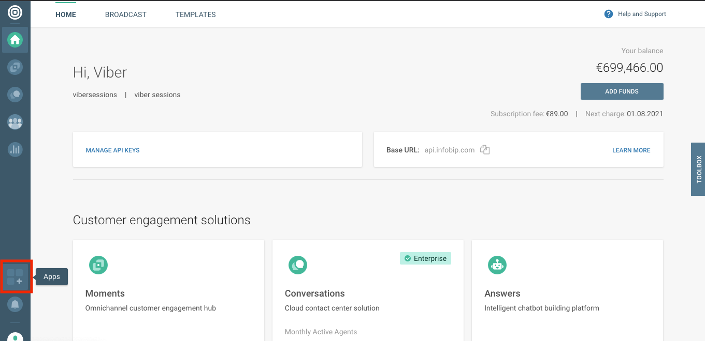
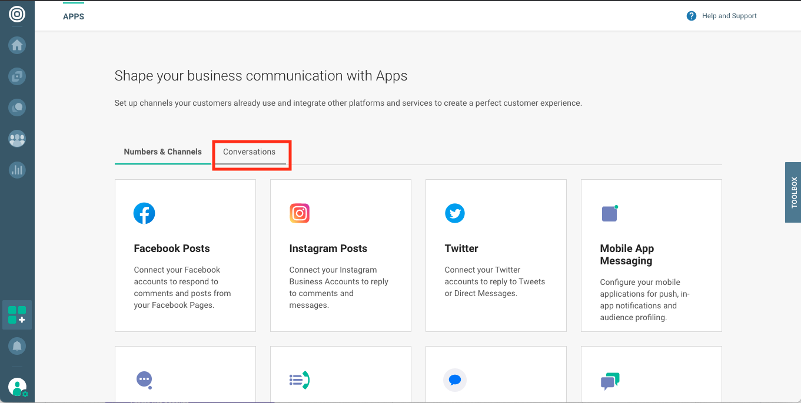
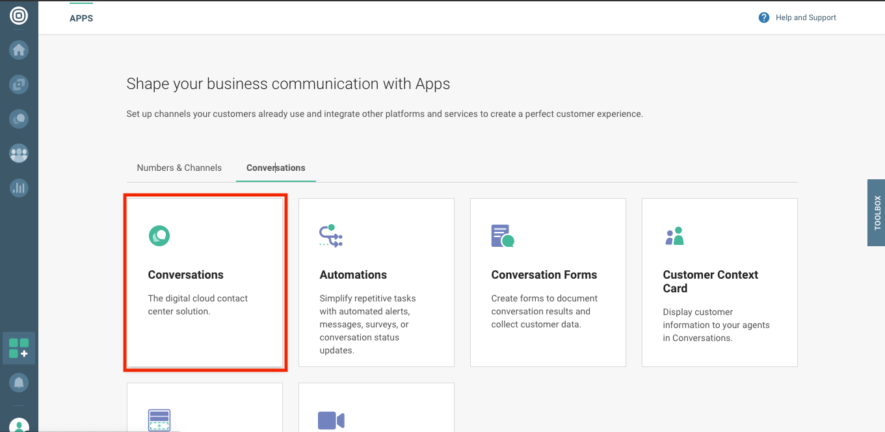
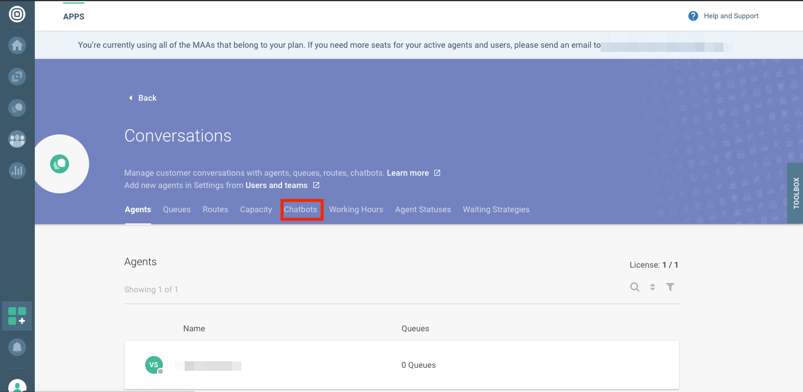
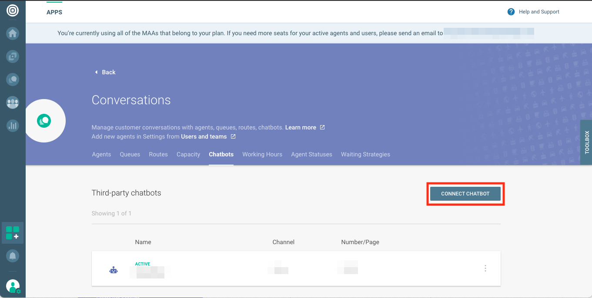
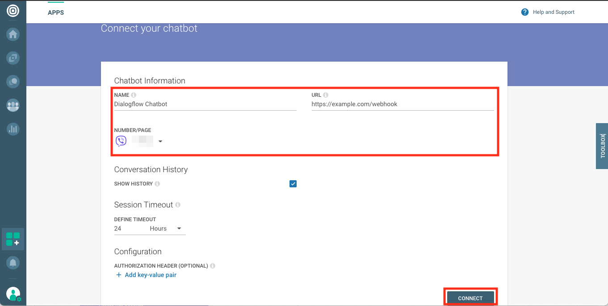
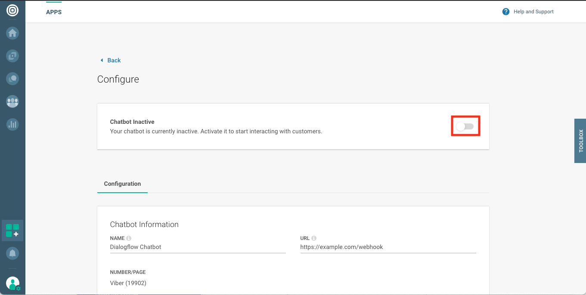
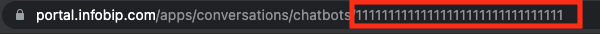

# Infobip Conversations Integration

## Setup

### Prerequisites

- Follow the instructions on the [main README file](https://github.com/GoogleCloudPlatform/dialogflow-integrations#readme) in the root directory of this repository.
- Set up [Infobip](https://infobip.com) account with [Conversations](https://www.infobip.com/docs/conversations)

<a name="SettingUpInfobipConversations"></a>
### Setting up Infobip Conversations

- Log in to [Infobip's Customer Portal](https://portal.infobip.com)
- Navigate to "apps"

- Switch to "Conversations" tab

- Choose "Conversations"

- Choose "Chatbots"

- Click "Connect Chatbot" button

- Provide chatbot details (name, webhook URL and number/page) and click "Connect" button

  As URL you need to provide address of webhook exposed by your app. In case you don't know it yet, please provide placeholder and edit that after app is deployed.
  To be able to edit URL, external bot needs to be inactive state.

- Activate your chatbot

- Make note of your chatbot ID. You'll need it later when configuring chatbot app 


<a name="ProvidingConfigurationForApplication"></a>
### Providing configuration for application

Provide values for the following variables inside of `src/configuration_provider.js` file.
Alternatively you can provide environment variables for your container.

| Variable       | Environment variable           | Description |
|---             |---                             |---	|
| project        | DIALOGFLOW_PROJECT             | ID of GCP project running Dialogflow |
| agentId        | DIALOGFLOW_AGENT_ID            | ID of Dialogflow Agent |
| agentLocation  | DIALOGFLOW_AGENT_LOCATION      | Location where Dialogflow agent is deployed |
| infobipBaseUrl | INFOBIP_BASE_URL               | You need to provide base URL as listed on https://portal.infobip.com homepage. |
| infobipApiKey  | INFOBIP_API_KEY                | To authenticate when sending messages to Infobip. More on https://portal.infobip.com/settings/accounts/api-keys |
| language       | BOT_LANGUAGE                   | Language used when processing content on Dialogflow side |
| infobipBotId   | INFOBIP_BOT_ID                 | ID of the external bot configured in Conversations |

### Deploying the Integration Using Cloud Run

In your local terminal, change the active directory to the repository’s root directory.

Run the following command to save the state of your repository into [GCP Container Registry](https://console.cloud.google.com/gcr/). Replace PROJECT-ID with your agent’s GCP Project ID and PLATFORM with the platform subdirectory name.

```shell
gcloud builds submit --tag gcr.io/PROJECT-ID/dialogflow-PLATFORM
```

Deploy your integration to live using the following command. Replace PROJECT-ID with your agent’s GCP project Id, PLATFORM with the platform subdirectory name, and YOUR_KEY_FILE with the name (not path) of your Service Account JSON key file.

```shell
gcloud beta run deploy --image gcr.io/PROJECT-ID/dialogflow-PLATFORM --update-env-vars GOOGLE_APPLICATION_CREDENTIALS=YOUR_KEY_FILE --memory 1Gi
```

- When prompted for a target platform, select a platform by entering the corresponding number (for example, ``1`` for ``Cloud Run (fully managed)``).
 - When prompted for a region, select a region (for example, ``us-central1``).
 - When prompted for a service name hit enter to accept the default.
 - When prompted to allow unauthenticated invocations press ``y``.
 - Copy the URL given to you, and use it according to the README file in the
 given integration's folder.

Take the value for the server URL printed in the console after the completion of the execution of the above command and replace the value for __SERVER_URL__ in the __server.js__ file.

Redeploy the integration with the updated change by rerunning the above two commands. 

More information can be found in Cloud Run
[documentation](https://cloud.google.com/run/docs/deploying).

You can view a list of your active integration deployments under [Cloud Run](https://console.cloud.google.com/run) in the GCP Console.