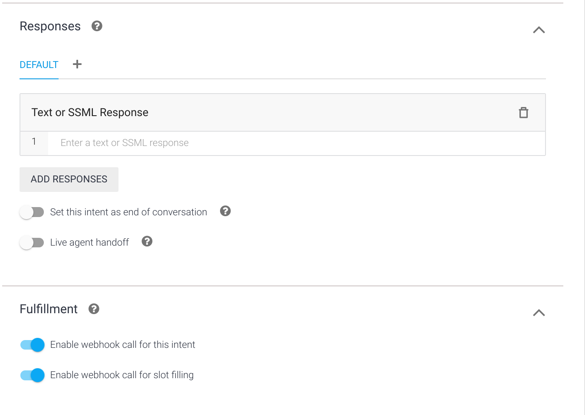
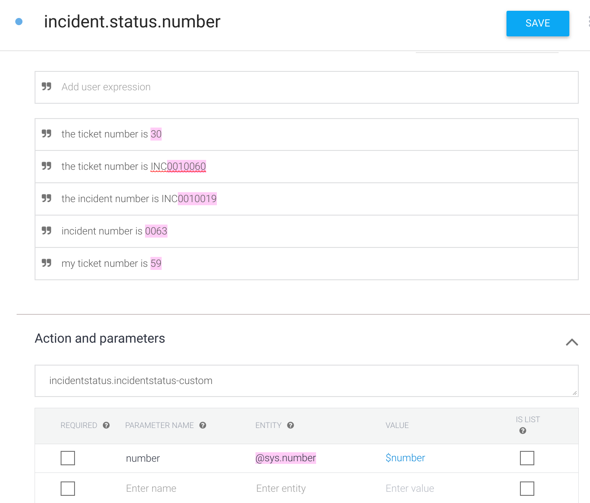
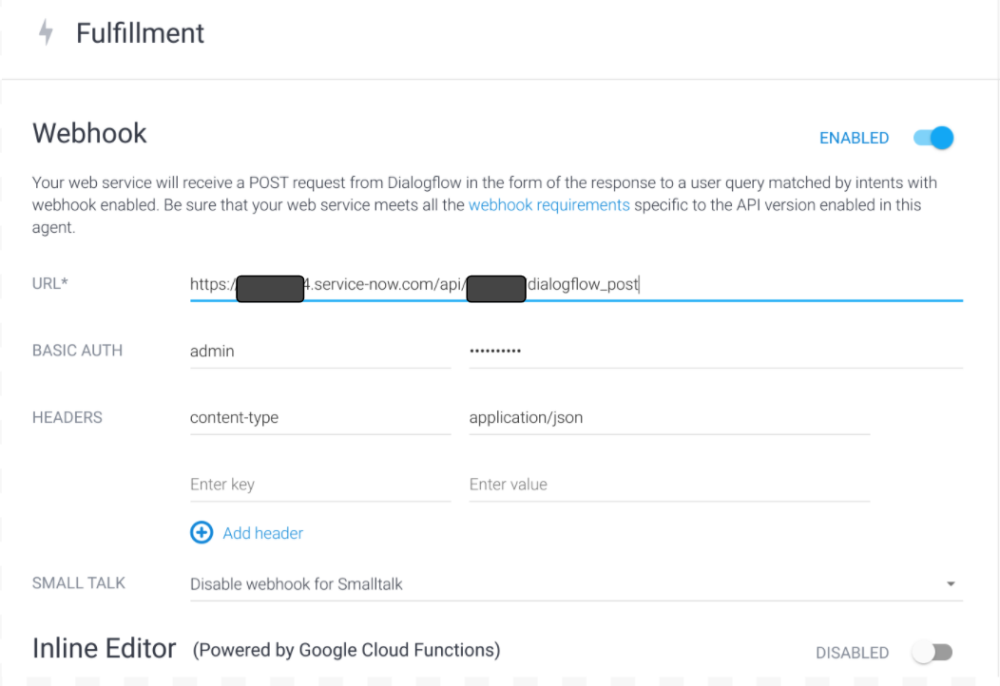
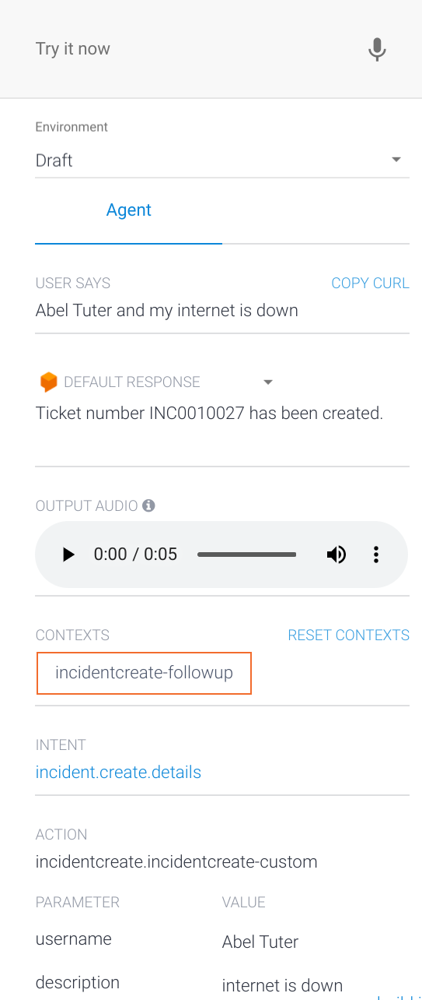
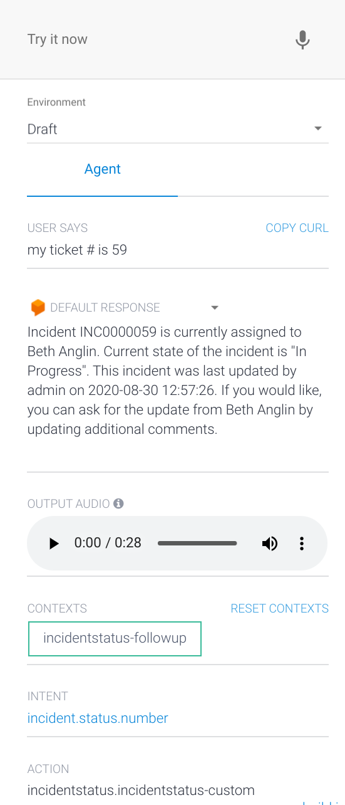

Copyright 2020 Google LLC

Licensed under the Apache License, Version 2.0 (the "License");

you may not use this file except in compliance with the License.

You may obtain a copy of the License at

    https://www.apache.org/licenses/LICENSE-2.0

Unless required by applicable law or agreed to in writing, software

distributed under the License is distributed on an "AS IS" BASIS,

WITHOUT WARRANTIES OR CONDITIONS OF ANY KIND, either express or implied.

See the License for the specific language governing permissions and

limitations under the License.

# **ServiceNow Integration**

## 
**Setup**

### 
**Prerequisites**

*   Follow the instructions on the [main README file](https://github.com/GoogleCloudPlatform/dialogflow-integrations#readme) in the root directory of this repository.
*   Create a [ServiceNow Developer account](https://developer.servicenow.com/dev.do).
*   Create a [Dialogflow Agent](https://dialogflow.cloud.google.com/).

### 
**Configuring ServiceNow**

*   Log into your ServiceNow Developer account.  If this is the first time you are logging in, you will need to create an _Instance_.  Follow the instructions on creating an Instance and select a _Release_.  As of this writing, Paris is the latest Release and it is recommended that you choose one of the latest releases, Orlando or Paris for this integration.
*   Click on your Instance URL (ex. _https://dev10101.service-now.com/_) and log in.  You will now be logged into the admin console.
*   From the Navigation menu, search for “Scripted REST APIs” and select this option.
*   From the Scripted REST APIs menu, click on the “New” button.
*   Provide a descriptive name like “Dialogflow Post”.  The API ID field will be automatically populated after you provide a name.  Click on the “Submit” button.

*   You will be returned to the “Scripted REST APIs” menu.  From the list of Services, find and select the one you just created.
*   **_Make a note of the “Base API path” as you will use this value to make your Dialogflow Webhook._**

*   Scroll down the page and on the Resources tab, click on the “New” button.

    

*   On the “Scripted REST Resource” page, provide a descriptive Name and in the “HTTP method” field, select “POST”.

 

*   In the “Script” section, replace the code with the code in the file “servicenow-script.txt” and then click the “Submit” button at the top.

### 
**Configuring Dialogflow**

*   In the [Dialogflow Console](https://dialogflow.cloud.google.com/), click on "Intents" and then click on the “Create Intent” button.  We will create the first intent to create an incident/ticket in ServiceNow.
*   Name the first Intent “incident.create” to match the name used in the ServiceNow script.
*   Provide a few “Training phrases” that you would like to trigger the Intent detection of this Intent like: _“I need to open a ticket”, “create an incident”, “Helpdesk Support”, etc._
*   In the “Responses” section, provide a Default Response _“Please provide your user name and short description of the issue.”_ and click the “Save” button.
*   From the Navigation menu, click on “Intents” and hover your mouse over the Intent you just created and select “Add follow-up intent”->”custom”.
*   Click on the new follow-up Intent and edit the Intent name to “incident.create.details”.
*   Provide a few “Training Phrases” to trigger the Intent detection of this Intent: _“David Miller and need to reset my password”, “Abel Tuter, my laptop has a black screen”, “Bud Richardson and my mobile phone will not turn on”_.  **_Note: The user name you provide here must match a name in the ServiceNow Users table.  From the ServiceNow Navigation menu, search for “Users” under Organization for a list of all users.  Sample data comes pre-loaded with new developer instances._**
*   The user name in the “Training Phrases” should have been detected as an Entity of type @sys.person, or @sys.given-name, or combination of.  Typically @sys.person is the recommended Entity type for a person’s name (first and last name).  However, when passing this parameter as a Rest request, an additional key value of “name:” gets passed along with the variable which doesn’t work with the ServiceNow function code.  
*   For this example, we will change each occurrence of the user name to an Entity of @sys.any and give it a parameter name of “username” and value “$username”.  To edit, click on the user name in the “Training Phrases”, select to delete any default Entity types, highlight the full user name, and change to @sys.any type.  For the short description of the user’s issue, highlight the issue statement and select Entity of @sys.any and provide a parameter name of “description” and value “$description”.  Your “Training Phrases” and “Action and parameters” sections should appear as followed:

*   Scroll down the page and leave the “Responses” section blank.  Expand the “Fulfillment” section and switch the toggle button to enable both options as follows:

*   Click the “Save” button at the top.  
*   We have just created the Intent to create a new incident/ticket in ServiceNow.  We will now create the second intent that checks on the status of an incident/ticket in ServiceNow.
*   From the Navigation menu, click on “Intents” and click on the “Create Intent” button.
*   Name the second Intent “incident.status” to match the name used in the ServiceNow script.
*   Provide a few “Training phrases” that you would like to trigger the Intent detection of this Intent like: _“what is the status of my ticket”, “I would like status on my incident”, “check on status of my ticket”, etc._
*   In the “Responses” section, provide a Default Response _“Okay, please provide your ticket number.”_ and click the “Save” button.
*   From the Navigation menu, click on “Intents” and hover your mouse over the Intent you just created and select “Add follow-up intent”->”custom”.
*   Click on the new follow-up Intent and edit the Intent name to “incident.status.number”.
*   Provide a few “Training Phrases” to trigger the Intent detection of this Intent: _“my ticket number is 30”, “the ticket number is INC0010060”, “my ticket # is 59”_.  **_Note: The ticket number that you provide here must match a number in the ServiceNow Incident table.  From the Navigation menu, search for “Incident” and click on “Open” for a list of all open tickets.  _**
*   The actual number in the “Training Phrases” should have been detected as an Entity of type @sys.number.   Ensure to highlight the full number and select Entity of @sys.number and provide a parameter name of “number” and value “$number”.  Your “Training Phrases” and “Action and parameters” sections should appear as followed:

*   Scroll down the page and leave the “Responses” section blank.  Expand the “Fulfillment” section and switch the toggle button to enable both options as follows:

*   Click the “Save” button at the top.  We have just created the Intent to get the status of an incident/ticket in ServiceNow.  
*   Now we need to configure our Webhook.
*   From the Dialogflow Navigation menu, click on “Fulfillment”.
*   Switch the toggle to enable the Webhook.
*   For “URL”, enter your ServiceNow Developer Instance URL along with the “Base API Path” to the ServiceNow Scripted REST Service that you created in an earlier step.
*   For “Basic Auth”, enter the login and password.  **_Note_**: _In this example we use the Admin credentials for simplicity, but for more than a Sandbox, you would want to create a new user to make the web requests or better, configure OAuth tokens._
*   For “Headers”, enter a key of “content-type” with a value of “application/json”.  Your Webhook should look similar to this:

*   Scroll down and click on the “Save” button.

### 
**Testing the Integration**

*   You have now completed all the necessary steps and can test your integration in the “Try it now” window.
*   Try creating a ticket:

*   Try checking on the status of a ticket:

### 

*   From the ServiceNow console Navigation menu, search for “incident” and click on “Open” for a list of all open tickets.  Find the ticket you just created:

