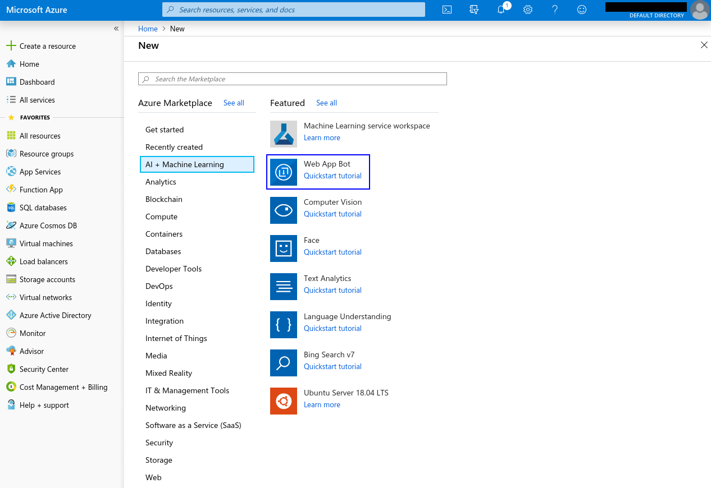

# Skype Integration

## Setup

### Prerequisites

- Follow the instructions on the [main README file](https://github.com/GoogleCloudPlatform/dialogflow-integrations#readme) in the root directory of this repository.
- Create a [Microsoft Azure account](http://developer.twitter.com/en/apply/user).
- Replace the value of __projectId__ in the [server.js file](https://github.com/GoogleCloudPlatform/dialogflow-integrations/blob/03676af04840c21c12e2590393d5542602591bee/skype/server.js#L33) with your Dialogflow agent’s Project ID.

### Creating a Skype Bot

- Log in to Azure and go to your [portal](https://portal.azure.com/#home). 
- Click on "Create new resource", then select "AI + Machine Learning" and then "Web App Bot". 
- Fill out the following form to create your bot.



### Getting Credentials

- Go to the "All Resources" tab and click on your newly created bot.
- Go to the configuration page.
- Take the values for __MicrosoftAppId__ and __MicrosoftAppPassword__ and replace the values for __appId__ and __appPassword__ in the [server.js file](https://github.com/GoogleCloudPlatform/dialogflow-integrations/blob/03676af04840c21c12e2590393d5542602591bee/skype/server.js#L34-L35) respectively.

### Deploying the Integration Using Cloud Run

In your local terminal, change the active directory to the repository’s root directory.

Run the following command to save the state of your repository into [GCP Container Registry](https://console.cloud.google.com/gcr/). Replace PROJECT-ID with your agent’s GCP Project ID and PLATFORM with the platform subdirectory name.

```shell
gcloud builds submit --tag gcr.io/PROJECT-ID/dialogflow-PLATFORM
```

Deploy your integration to live using the following command. Replace PROJECT-ID with your agent’s GCP project Id, PLATFORM with the platform subdirectory name, and YOUR_KEY_FILE with the name (not path) of your Service Account JSON key file.

```shell
gcloud beta run deploy --image gcr.io/PROJECT-ID/dialogflow-PLATFORM --update-env-vars GOOGLE_APPLICATION_CREDENTIALS=YOUR_KEY_FILE --memory 1Gi
```

- When prompted for a target platform, select a platform by entering the corresponding number (for example, ``1`` for ``Cloud Run (fully managed)``).
 - When prompted for a region, select a region (for example, ``us-central1``).
 - When prompted for a service name hit enter to accept the default.
 - When prompted to allow unauthenticated invocations press ``y``.
 - Copy the URL given to you, and use it according to the README file in the
 given integration's folder.

More information can be found in Cloud Run
[documentation](https://cloud.google.com/run/docs/deploying).

You can view a list of your active integration deployments under [Cloud Run](https://console.cloud.google.com/run) in the GCP Console.

### Setting Messaging Endpoint on Skype/Azure

Go to your bot's Azure settings page. Take your integration deployment URL and enter it into the __Messaging Endpoint__ field.
