# stacklogs-looker
Exporting Dialogflow Log Files to BigQuery and Visualizing Conversations with Looker


High Level Overview
1. Create Dialogflow Agent
2. Create BigQuery dataSet to hold Dialogflow Stackdriver Logs and Looker Persistent Derived Table
3. Create StackDriver Sink Export to BigQuery
4. Confirm BigQuery Logs being loaded using SQL Test
5. Define Looker Connection to BigQuery, Create Looker Service Account, and make sure to configure Persistent Derived Table
6. Install the the Dialogflow Parser Block via the [Looker Marketplace](https://docs.looker.com/data-modeling/marketplace)
7. Create reports and dashboards with your parsed Dialogflow Interactions


How Stackdriver exports work:

The following diagram illustrates how Cloud Logging treats exported log entries:
https://cloud.google.com/logging/docs/export#overview

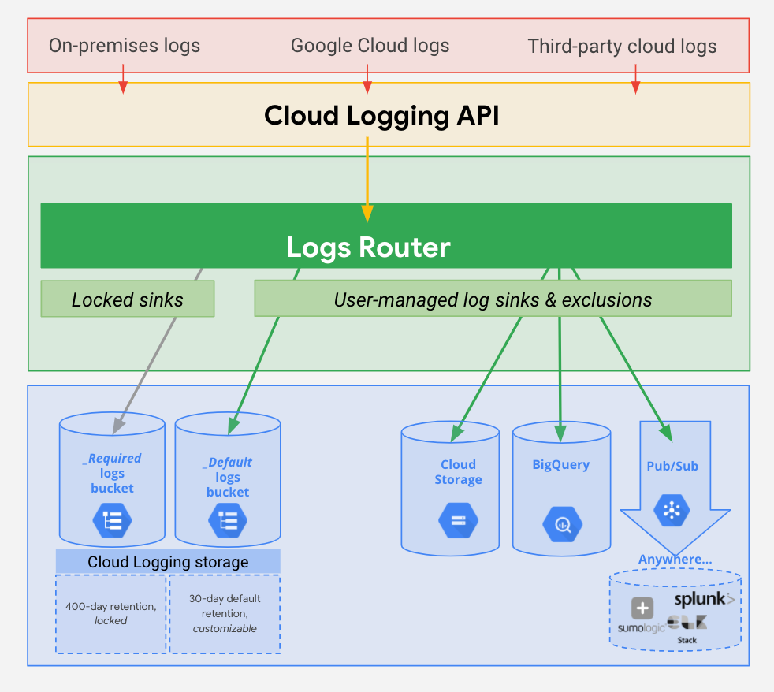

**Prerequisites:**

1. You must have a Google Cloud project with logs that you can see in the Logs Viewer.

2. You must also have the Owner or the Logging/Logs Configuration Writer IAM roles in the project to create, delete, or modify a sink. Go to Permissions and roles for more information.

3. Destination service: To export logs, you must sign up for the Google Cloud service to which you will write your logs: Cloud Storage, BigQuery, or Pub/Sub.
More Information: https://cloud.google.com/logging/docs/export/configure_export_v2

4. You will need your own Looker instance. [Looker GCP Marketplace](https://pantheon.corp.google.com/marketplace/partners/looker-public)
The Looker product is eligible for the Google Cloud Platform free trial. You can cancel, upgrade, or downgrade your Looker service at any time. Upgrades take effect immediately, and cancellations and downgrades take effect at the end of the subscription cycle: You will be billed under the current plan until then. Plans are billed for one day minimum. [Learn more about GCP Free Trial](https://cloud.google.com/free-trial)

For this project we are going to use Google's Dialogflow Logs that are captured via Stackdriver and push those logs to a sink that is loading those logs files  directly into BigQuery.  This enables real time analysis of the chatbot. We can then visualize that raw log files using Looker Dialogflow Parser Block, which distills the log files into report elements and dimensions that can be used to create reports and dashboards. 

Here is a high level architecture overview of solution

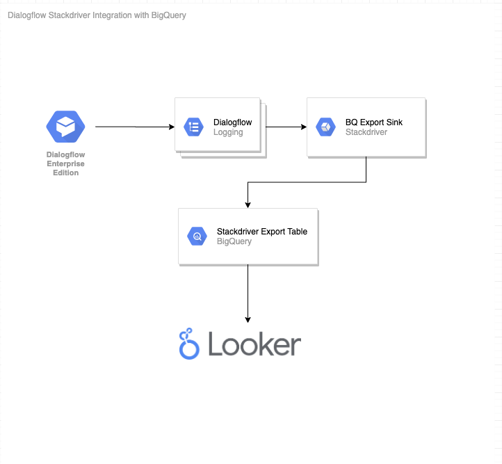

**Start:**

From StackDriver Logging, you can create a sink that directly exports log files to BigQuery

Creating sinks -
You can create a sink using either the Logs Viewer or Logs Router.

Under Log Router - Select Create Sink and select BigQuery dataset

Then you will be able to select the log file that you want to export to BigQuery.

All the dialogflow logs are captured under resource type “Global” and there are two logs that you see that are specific dialogflow: “dialogflow_agent” and “dialogflow.googleapis.com/incoming_call”. 

Using this you can test to see if you are pulling the correct logs, and then you can use the create sink wizard on the right. 

1. Sink name: Enter the identifier you want to assign to the sink.

2. Sink Service: Select a destination service: Cloud Storage, Pub/Sub, BigQuery or Custom Destination.

A custom export destination still has to be in Cloud Storage, BigQuery, or Pub/Sub, but allows you to send logs to a sink in a different Google Cloud project. The sink's source and the destination don't have to be within the same Google Cloud organization.

3. Sink Destination:
BigQuery: Select or create the particular dataset to receive the exported logs. You also have the option to use partitioned tables.

4. Click Update Sink to create the sink.


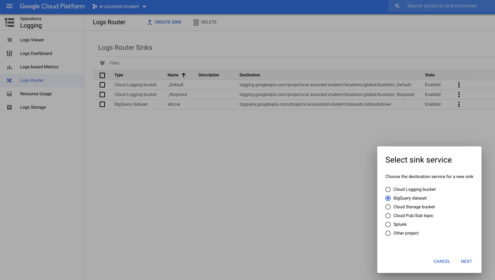


When creating the sink,  we limited the logs to be exported just to Dialogflow by selecting to only export those logs that equal: resource.type="global" 
You can see that there are two log files related to Dialogflow. We would like to select ALL Logs to push both logs to BigQuery.

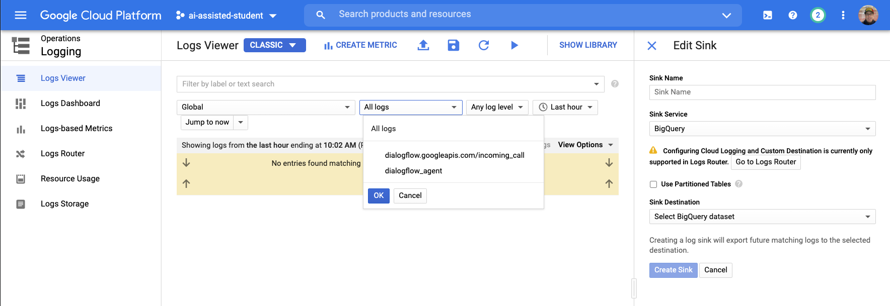

You can use the sink creation wizard, where you provide the sink name, the destination - BigQuery, and you can either select a BigQuery dataSet, or create a BigQuery dataSet. The dataset is going to receive the dialogflow logs.

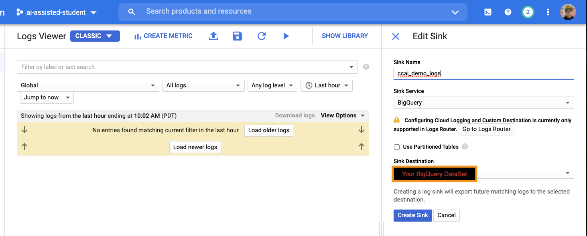

For this demo we created a data set in BigQuery called "Allstackdriver"
And we created another BigQuery dataset called "Looker_Scratch2".  You may choose a different name.

"allstackdriver" is the dataset that will receive the dialogflow log files from Stackdriver.
And "Looker_Scratch2" will be used to hold the persistent derived table that parses the raw Dialogflow logs into a Looker ML that can be used to build real time dashboards.

Once the sink is created, you can view the details and you should see something similar to this screenshot. 


Now that the sink is set up, go to your Dialogflow agent and generate a few logs by querying the virtual agent 4-5 times.

After generating a few Dialogflow converstations, you can test the sink export to BQ by going to bigquery and running a query like this (just change the date to today’s date and change to your dataset name.

Here is a simple query that we can run from BigQuery to test the sink and see the logs in realtime. 
```
SELECT resource, textPayload, timestamp 
FROM `<YOURPROJECTID>.<YOURDATASET>.dialogflow_agent` 
WHERE DATE(timestamp) = "2020-08-03" LIMIT 1000
```

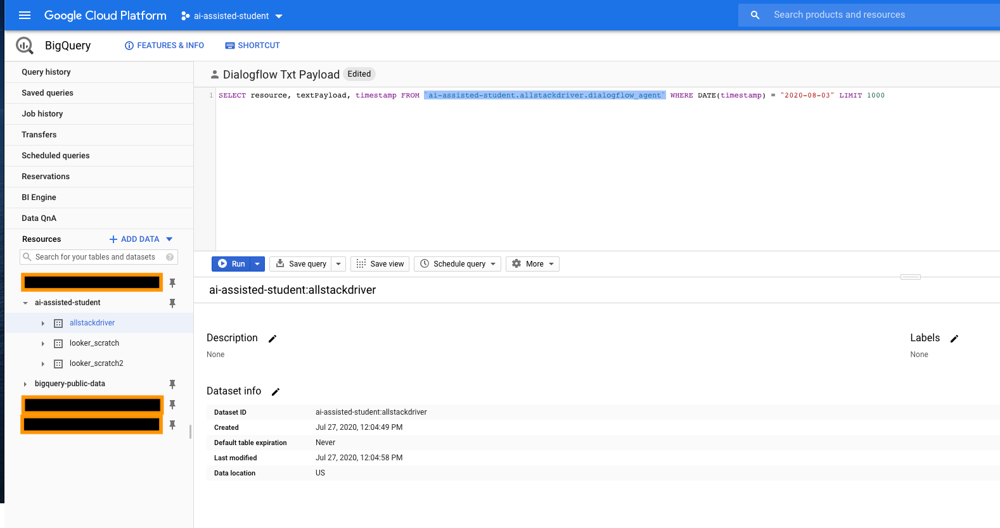

Here is a screenshot of my BigQuery Report

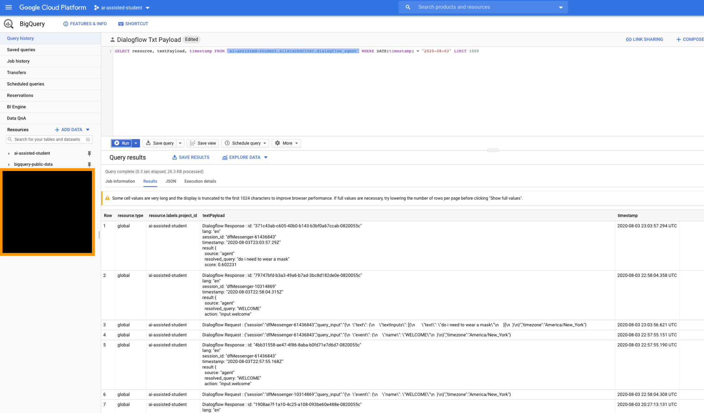


Now we can use Looker to set up a connection to BigQuery and install the Dialogflow Log Parse Block to start analyzing our Dialogflow logs. 

___


## LOOKER DEMO - STEP 1 CONNECTIONS
First, let's go to our Looker instance and set up a connection to BigQuery.

Under the Looker Admin Menu - You find Database - Connections

Open Connections

Let’s show how a user could create a new connection and let’s highlight the breath of database connections that Looker supports. 

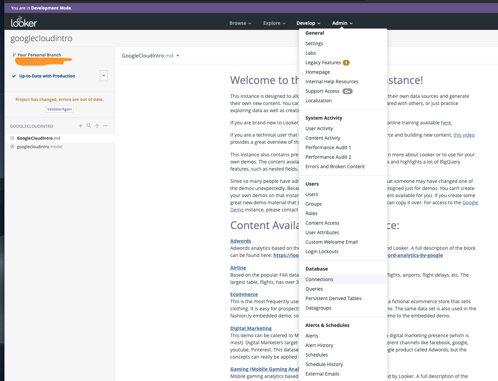

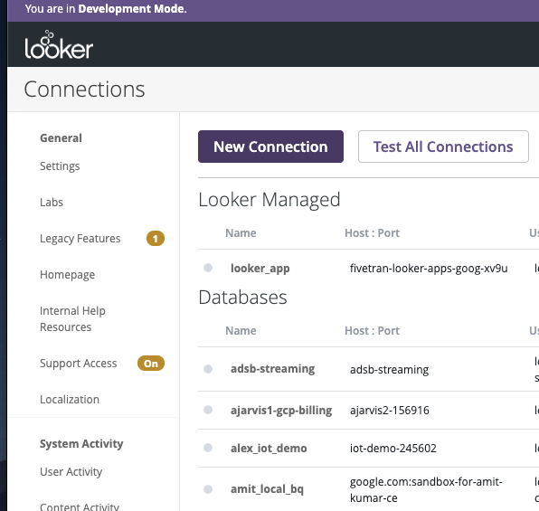

Here where you would define a connection to BigQuery. 
Notice the BigQuery Connector and the broad support for other databases.


Looker supports a wide range of SQL database dialects and will continue to improve the feature implementations for existing dialect options as well as add new dialects. Because our modeling layer, LookML, builds on top of the in-database features available, some dialects allow for a more powerful implementation than others. More Info - https://docs.looker.com/setup-and-management/database-config


Here are the instructions on how to connect Looker to your BigQuery dataSet: 
https://docs.looker.com/setup-and-management/database-config/google-bigquery

The general steps for setting up a Google BigQuery Standard SQL or Google BigQuery Legacy SQL connection are:

1. Create a service account with access to the Google project and download the JSON credentials certificate.
2. Create a temporary dataset for storing persistent derived tables.
3. Set up the Looker connection to your database.
4. Test the connection.


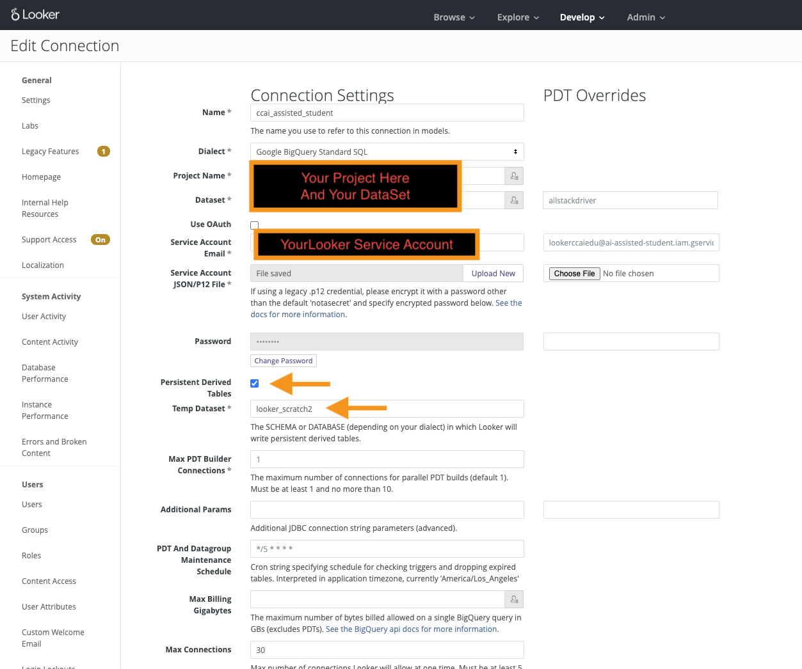

## LOOKER - STEP 2 INSTALL THE DIALOGFLOW LOOKER BLOCK

Once we have our connection to BigQuery established, we can easily install the Dialogflow Parser Block from the [Looker Marketplace](https://docs.looker.com/data-modeling/marketplace). This prebuilt LookML model will help us: 

1. Analyze Dialogflow Efficiency by providing visibility into Dialogflow application performance so that we can identify the frequency and type of user queries that are being resolved inefficiently and remediate those interactions accordingly.

2. Understand User Behavior by providing insight into the topics that users most frequently ask questions about, the nature of how their questions are phrased, and their satisfaction with answers so that we can fine-tune your interactions to maximize customer satisfaction.

To navigate to the marketplace, we'll click on the "shop" icon on the top right of the navbar.


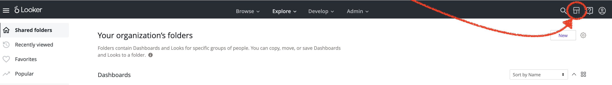


Here in the marketplace you can find additional visualizations, models, and extensions for your Looker instance including custom web applications like the [Data Dictionary](https://docs.looker.com/data-modeling/extension-framework/data-dictionary) and popular blocks for [Google Marketing Platform](https://looker.com/platform/blocks/source/looker-for-google-marketing-platform). 

We'll find the Dialogflow Parser Block under "Models". 

 
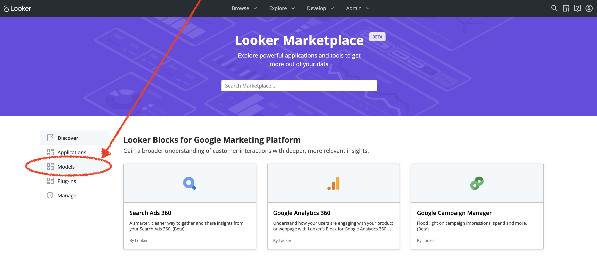


Once in "Models", we'll locate the Dialogflow Parser Block.


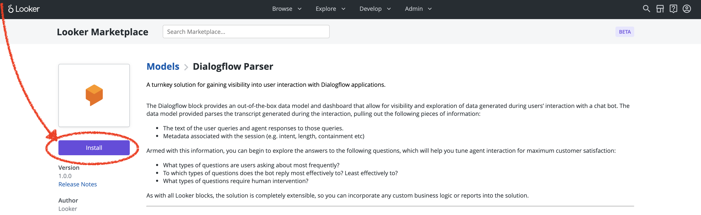


After hitting the "Install" button, we'll enter our BigQuery connection and dataset and finalize the installation.

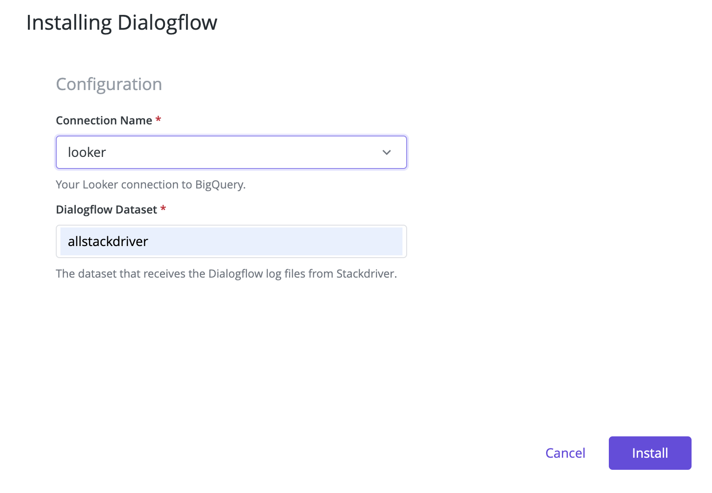


Marketplace installations currently create two projects on our Looker instance, a "Core" (read-only) and "Config" (write). The "Core" project holds the main LookML model for our block and allows us to get updates from the marketplace when avalible. The "Config" allows us to make changes to the underlying model and edit or add fields if necessary. You can [check out the Looker docs](https://docs.looker.com/data-modeling/marketplace/customize-blocks) for more info on customizing marketplace installation. 


**And Finally...**

Once you have the Dialogflow Parser Looker ML project installed and connected you can "explore" that project, build a report and add it to your dashboard.  Reference on how to [Create and edit a Looker Report](https://docs.looker.com/dashboards/dashboards-reports-intro).
 
You can find the "Parsed Transcripts" explore in the "Explore" drop down:

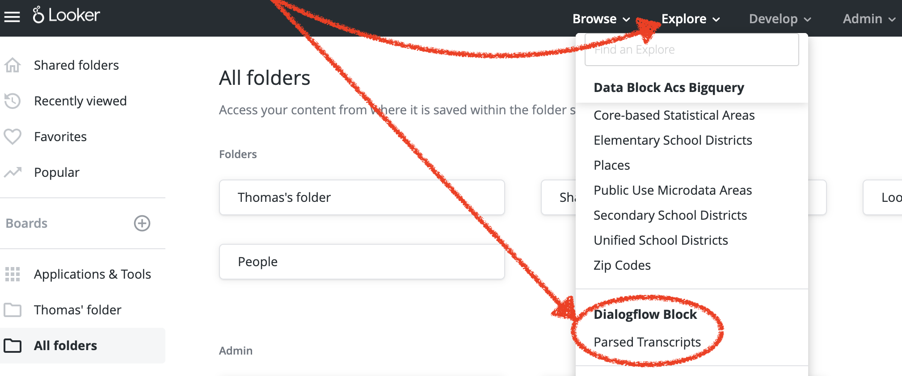


Here is a sample report that is parsing the user question and the bot answer.

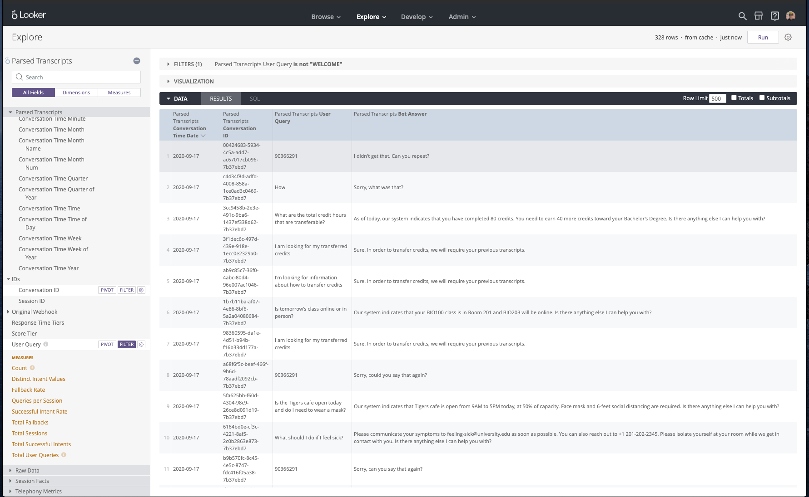
 
 
 Here is that same report, added to a dashboard


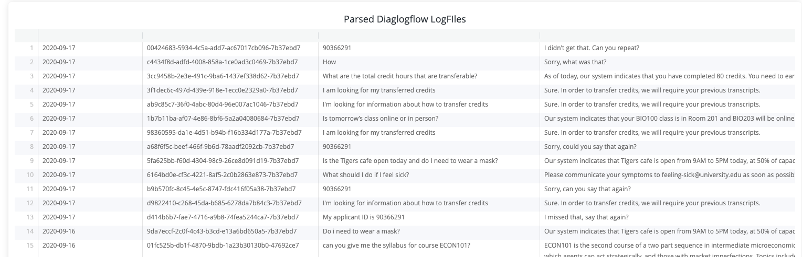
 
 


**Integrating Looker with Git (Optional)**

Looker uses Git to record changes and manage file versions. Each LookML project corresponds to a Git repository, and any time a user is in Development Mode that user is on their own Git branch. Git repositories are often called repos.

For LookML source file management, Looker can be configured with any Git provider that uses an SSH key or HTTPS for authentication. The general steps are the same no matter which platform you use. This page uses GitHub as an example for connecting a Looker project to Git once you have created a Git repository.

Marketplace installations are created with a ["bare repo"](https://docs.looker.com/data-modeling/getting-started/setting-up-git-connection#configuring_a_bare_git_repository) meaning developers can make commits and push to production locally without needing to set up a remote repo. Generally however, it is highly recommended to set up a remote repo for each LookML project. 

To access Git integration options, you must have Development Mode turned on.

***This is not an officially supported Google product***


