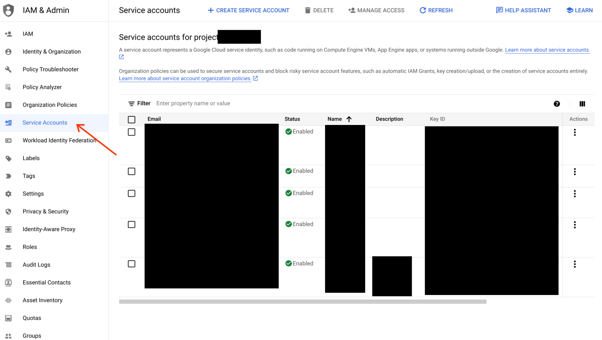
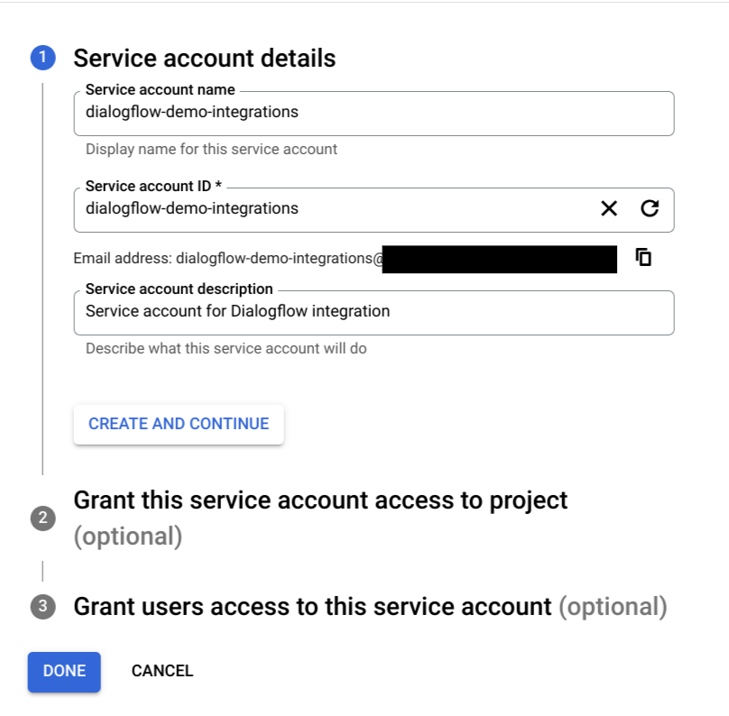
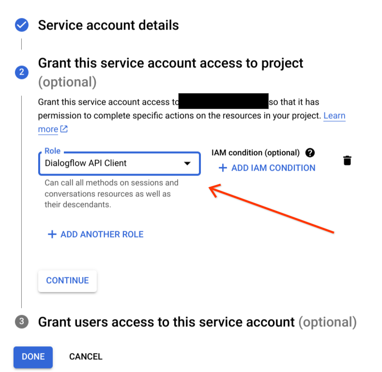
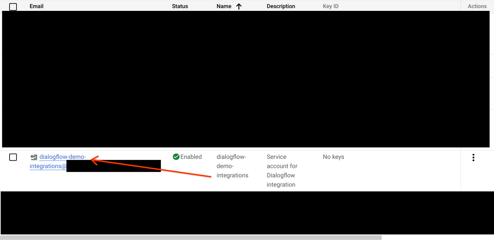
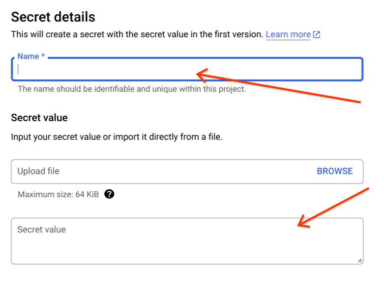
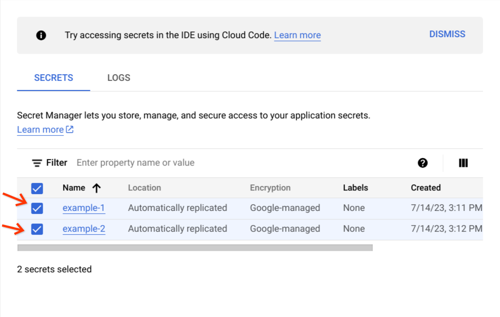
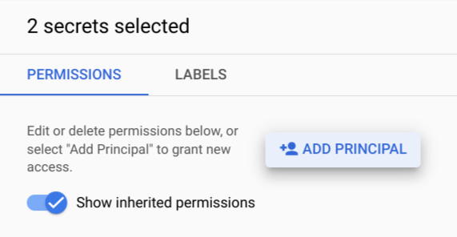
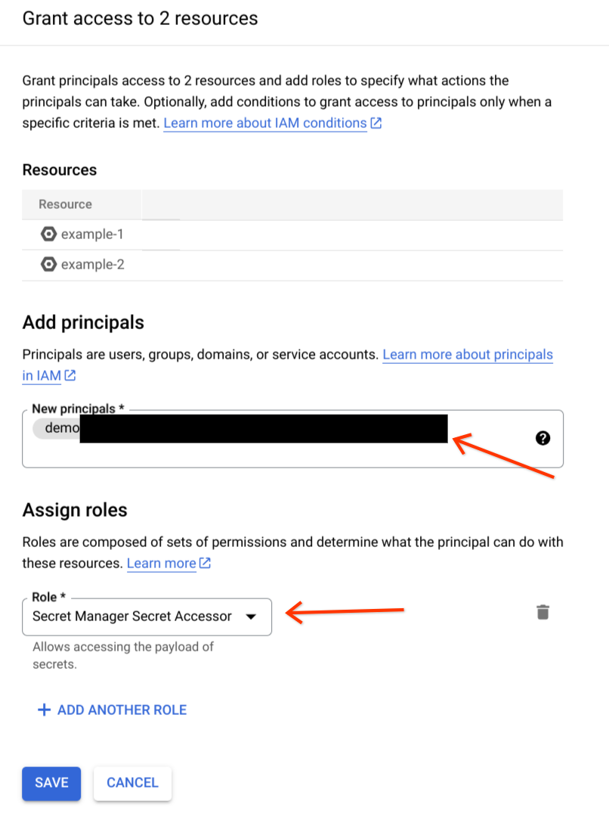
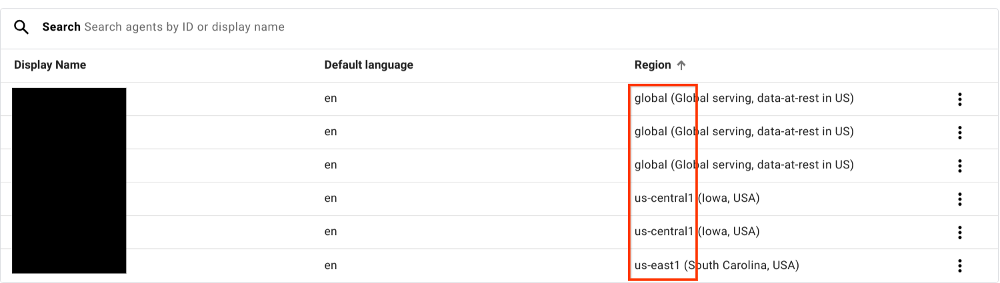

# Dialogflow Typescript Integrations

## Introduction

The purpose of this folder is to provide samples and instructions for connecting your Dialogflow agent to third party services and chat platforms.

If you do not have an existing Dialogflow agent, you can set one up by reading [the documentation](https://cloud.google.com/dialogflow/docs/).

## Prerequisites

- [GCP Project](https://cloud.google.com/resource-manager/docs/creating-managing-projects)
- [Dialogflow Agent](https://cloud.google.com/dialogflow/docs/)

## Supported Platforms

### Webhook Integrations

These integrations require an intermediary server to communicate between the 3rd party platform and your Dialogflow agent. Although it is possible to deploy these integrations on any hosting platform, these instructions will use [Google Cloud Run](https://cloud.google.com/run/).

- [Slack](./src/slack#readme) (CX only)
- [Twilio](./src/twilio#readme) (ES/CX)
- [Viber](./src/viber#readme) (ES/CX)
- [Webex](./src/webex#readme) (ES/CX)

## Webhook Integration Setup 

### Configure Billing

Open the GCP project associated with your Dialogflow agent.

For Dialogflow ES:
1. Open the agent settings by selecting the gear on the left navigation menu
2. Open the link to the right of **Project ID**

From the console, open **Billing** and configure billing for the project.

### Enable GCP APIs

Integrations will make use of **Cloud Build**, **Cloud Run**, **Secret Manager**, and **Artifact Registry**. [Enable these APIs](https://console.cloud.google.com/flows/enableapi?apiid=cloudbuild.googleapis.com,run.googleapis.com,secretmanager.googleapis.com,artifactregistry.googleapis.com) for your project.

### Create Service Account

For the integration to use GCP APIs, we will create a [**Service Account**](https://cloud.google.com/dialogflow/docs/quick/setup#sa-create) in the GCP project.

1. Open the agent's associated GCP project
2. From the cloud console's left navigation menu, select **IAM & Admin**
3. Select **Service Accounts**



4. Select **+ CREATE SERVICE ACCOUNT**


5. Fill the name while making note of the **Service account ID**. You may choose to enter a description.



6. Grant account access to **Dialogflow Client API** role, and then select **Continue**.



7. The third step is optional for our usage so you may continue.
8. Create the Service Account



If you are deploying this integration outside of GCP, you may authenticate using a key file. Deploying on Cloud Run or Cloud Functions eliminates this process.
1. Click on **+ Create Key** and download the resulting JSON key file. 
2. Save the JSON key file in the desired platform subdirectory. 
3. Set the `GOOGLE_APPLICATION_CREDENTIALS` environment variable on the deployment environment to the absolute path of Service Account JSON key file. See [this guide](https://cloud.google.com/dialogflow/docs/quick/setup#auth) for details.

### Setup `gcloud` CLI

The following instructions for deploying with Cloud Run will use `gcloud` CLI commands. You can choose to use [Cloud Shell](https://cloud.google.com/shell). Alternatively, you can choose to install the `gcloud` CLI locally by following the [documentation page](https://cloud.google.com/sdk/docs/quickstarts). We will assume **Cloud Shell** for these instructions, although any Bash-like shell should work.

### Set Project

1. Run the following command to confirm that you are authenticated:

```sh
gcloud auth list
```

2. Set your project with the following command:

```sh
gcloud config set project PROJECT_ID
```


### Clone the Repository

Navigate to the directory in which you would like to clone this repository folder into and execute

```sh
git clone --depth=1 https://github.com/GoogleCloudPlatform/dialogflow-integrations.git
cd dialogflow-integrations/ts
```

### Follow Integration Setup

This may include adding secrets to **Secret Manager** (more detail in next step), updating configuration parameters, and 3rd party platform configuration. See the [supported platforms](#webhook-integrations).

### Add Secrets to Secret Manager

If your integration specifies secrets to be added to **Secret Manager**, follow these steps for each secret.

1. Navigate to [**Secret Manager**](https://console.cloud.google.com/security/secret-manager) by selecting it from the left navigation menu in **Cloud Console** under **Security**
2. Select **+ CREATE SECRET**


3. Fill the **Name** and **Secret value** fields according to the instructions for your chosen integration.



4. Select **CREATE SECRET** at the bottom once you are satisfied with the configuration.

Once you have created the secrets specified for your integration, grant access to the service account created earlier. This will allow your **Cloud Run** deployment to access these secrets.

1. Select the secrets created for your integration.



2. On the right panel, select **ADD PRINCIPAL**



3. Add the service account under the **New principals** field and assign **Secret Manager Secret Accessor** role under the **Role** field.



### Define Local Environment Variables

These will set environment variables that will be referenced in later commands. Make sure to replace the values of the first two variables with the values you wish to specify. If you are not using a Bash-like shell, you will need to replace `$VARIABLES` in the following steps with their value.

To determine an appropriate region for our purposes, reference the regions available for [Artifact Registry](https://cloud.google.com/artifact-registry/docs/repositories/repo-locations) and [Cloud Run](https://cloud.google.com/run/docs/locations). For example we may select `us-central1`. You may want to coordinate this region with your agent's region.

```sh
GCP_SERVICE_ACCOUNT=your-service-account
DF_INTEGRATION=desired-platform-integration
GCP_LOCATION=us-central1
GCP_PROJECT=$(gcloud config get-value core/project)
```

### Create Artifact Registry Repository

To store the Docker images we will be creating for these integrations, we will create an [Artifact Registry](https://cloud.google.com/artifact-registry) repository.

```sh
gcloud artifacts repositories create dialogflow-integrations --repository-format=docker --location=$GCP_LOCATION --description="Docker repository for open-source Dialogflow integrations"
```

### Update `.env` Parameters

Use a text editor to open the `.env` file in this folder and update the following enviornment variables. You may need to configure your editor to show hidden files.

1. Set `AGENT_LOCATION` to the location of your agent as displayed in the dashboard

Region in Dialogflow ES:


Region in Dialogflow CX:



2. If your agent location is not `global`, update the `DF_ENDPOINT` line and set it to the endpoint matching your agent's location. You can reference the list of endpoints for [Dialogflow ES](https://cloud.google.com/dialogflow/es/docs/reference/rest/v2-overview#service-endpoint) or [Dialogflow CX](https://cloud.google.com/dialogflow/cx/docs/reference/rest/v3-overview#service-endpoint) to determine the appropriate API endpoint.
3. Set the `AGENT_TYPE` to the type of agent you are integrating with. Possible values are `"ES"` or `"CX"`.
4. If you are deploying a Dialogflow CX agent, you must update `AGENT_ID`.
Determine the `AGENT_ID` by navigating to the Dialogflow CX console and locating the **Agent Link** for your agent. The UUID identifying your agent will follow `agents` in the URL: `https://dialogflow.cloud.google.com/cx/projects/your-project-id/locations/us-central1/agents/{YOUR_AGENT_UUID}`
5. Update any parameters your integration specifies

### Build and Deploy the Integration

From the root directory (`ts`) run the following command to build your integration container.

```sh
gcloud builds submit --substitutions="_INTEGRATION=$DF_INTEGRATION,_LOCATION=$GCP_LOCATION"
```

Deploy the integration to **Cloud Run** using the following command. This command will deploy an instance named dialogflow-**integration**, using service account created earlier, and with access to the secrets specified.

If your shell is not bash-like replace all `$VARIABLES` with their respective value.
- If secrets were created for your integration, replace `$INTEGRATION_SECRETS` with the secrets specified for your installation, otherwise you may remove the `--update-secrets` argument.

If your integration specifies no secrets, or you have already added the secrets in a previous deployment, you may remove the `--update-secrets` argument.

If you are experiencing latency when the integration becomes inactive for some time, you can set `--min-instances 1` to ensure at least one instance of the integration is active to avoid [cold starts](https://cloud.google.com/run/docs/tips/general#use_minimum_instances_to_reduce_cold_starts). This may incur more costs as the integration will not "scale to zero."

```sh
gcloud run deploy dialogflow-$DF_INTEGRATION --image $GCP_LOCATION-docker.pkg.dev/$GCP_PROJECT/dialogflow-integrations/dialogflow-$DF_INTEGRATION --allow-unauthenticated --service-account $GCP_SERVICE_ACCOUNT --region=$GCP_LOCATION --update-secrets $INTEGRATION_SECRETS
```

## Webhook Integration Post-deployment

### Shutting Down an Integration

You can delete the Cloud Run service to shut down an integration setup with the above steps.

You can list your Cloud Run services.

```sh
gcloud run services list
```

Then you can delete the service associated with your integration.

```sh
gcloud run services delete <SERVICE_NAME>
```

### Multiple Integrations

To setup multiple integrations simultaneously, repeat the previous instructions for each deployment starting with platform-specific steps. Keep in mind that to modify a deployment you will need to set the `$DF_INTEGRATION` and other environment variables to the appropriate value for each integration.

### Changing Integration Behavior

The behavior of an integration can be customized by adding your own code or editing the source code in the platform directory. After making changes, update the deployment by re-running the build and deploy commands above. If your shell has been reset, you may also need to set the environment variables to the values specified in the previous instructions.

Reference the [recommended tools](./CONTRIBUTING.md) for development tips.

## Known Issues

- Long time to reply if integration has been inactive
  - This is due to cold starts, mitigation is included in **Build and Deploy the Integration**
