# Slack Integration for Dialogflow CX

Bridges your Dialogflow CX agent with a Slack chat bot using the [Bolt framework](https://github.com/slackapi/bolt-js). Dialogflow ES has [native support for Slack](https://cloud.google.com/dialogflow/es/docs/integrations/slack), so only CX is supported for this integration. 

## Prerequisites

- Prerequisites from the [primary README](../../README.md)
- Slack account and workspace

## Setup

Follow the instructions given in the [primary README](../../README.md). These instructions are meant to augment the primary instructions at certain points for Slack-specific steps.

### Setup Slack App
1. Create or sign in to your Slack account
2. Navigate to your [Slack Apps](https://api.slack.com/apps)
3. Select **Create New App** or **Create an App**, if this is your first App.

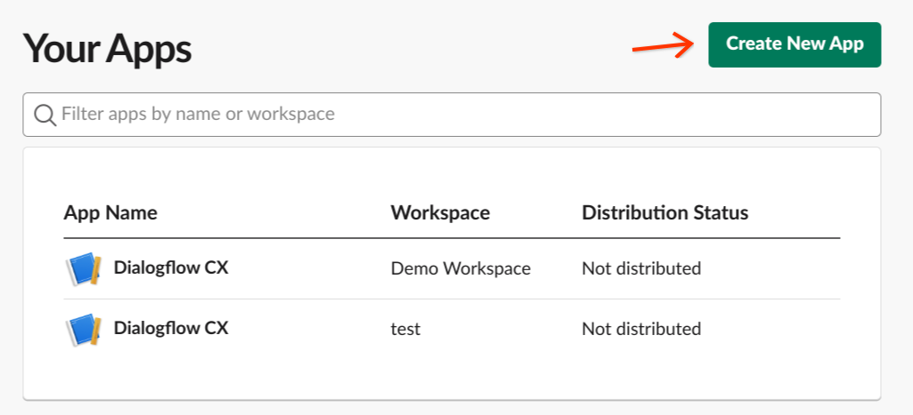

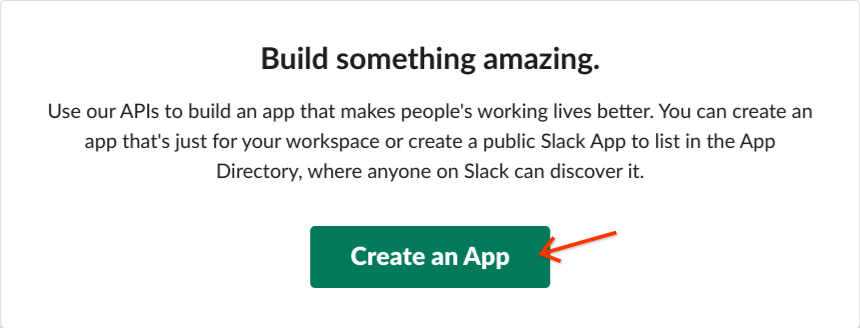

4. Select **From an app manifest**

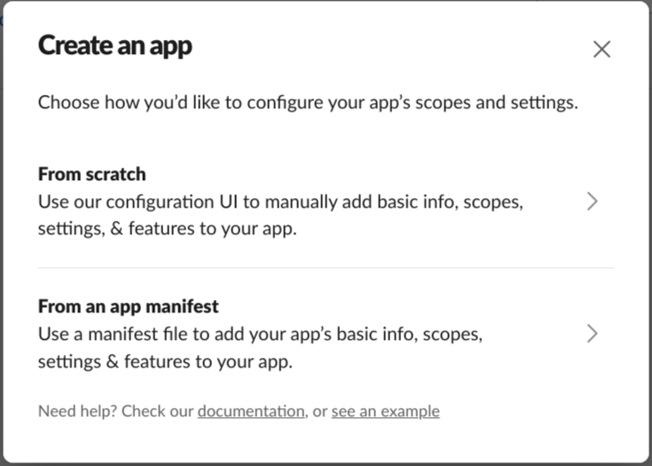

5. Select the workspace you would like to add the bot to

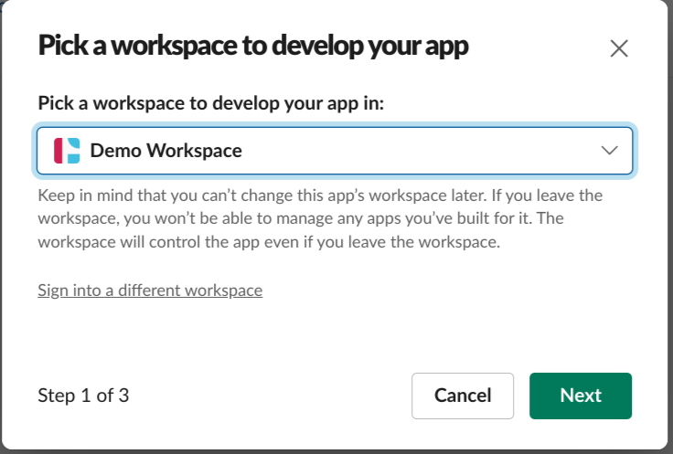

6. Copy the contents of the `manifest.yaml` into the manifest field

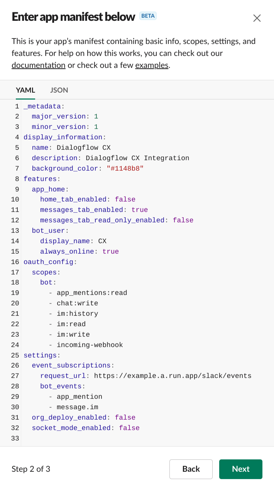

7. Review the app permissions and confirm by selecting **Create**

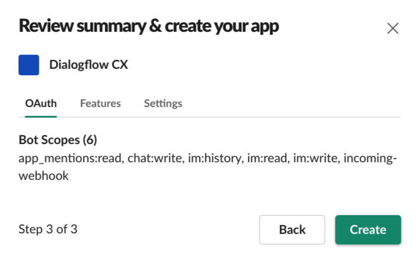

8. From the **Basic Information** section, select **Install to Workspace**

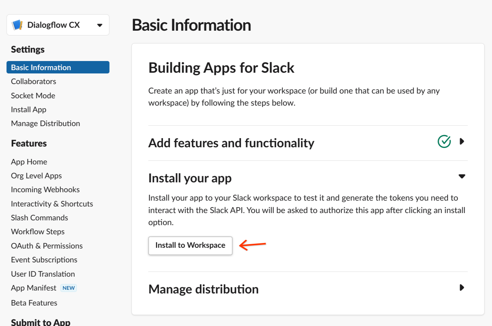

9. Select a channel to install the bot to and select **Allow**

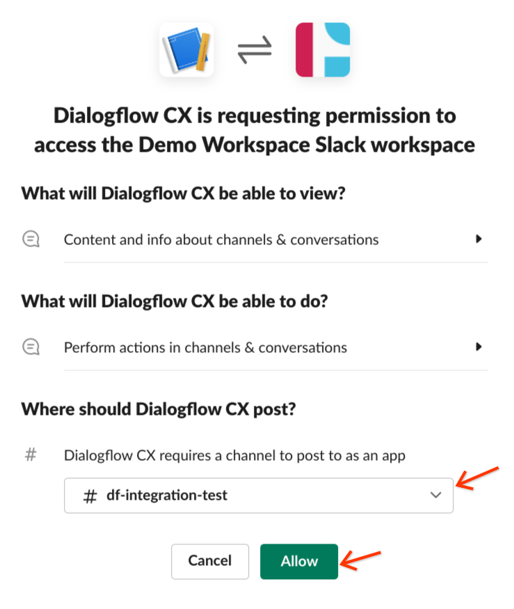

### Add Secrets to Secret Manager

Refer to the instructions in the [primary README](../../README.md) for creating the following secrets

| Secret Name          | Secret Value                                                                                                                                                                      |
|----------------------|-----------------------------------------------------------------------------------------------------------------------------------------------------------------------------------|
| slack-signing-secret | **Basic Information** > **App Credentials** > **Signing Secret** <br>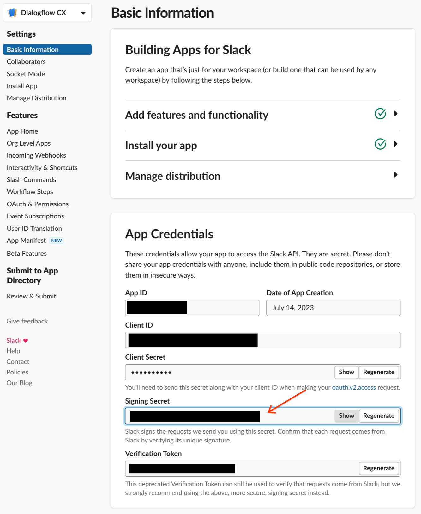             |
| slack-token          | **Install App** > **OAuth Tokens for Your Workspace** > **Bot User OAuth Token** <br>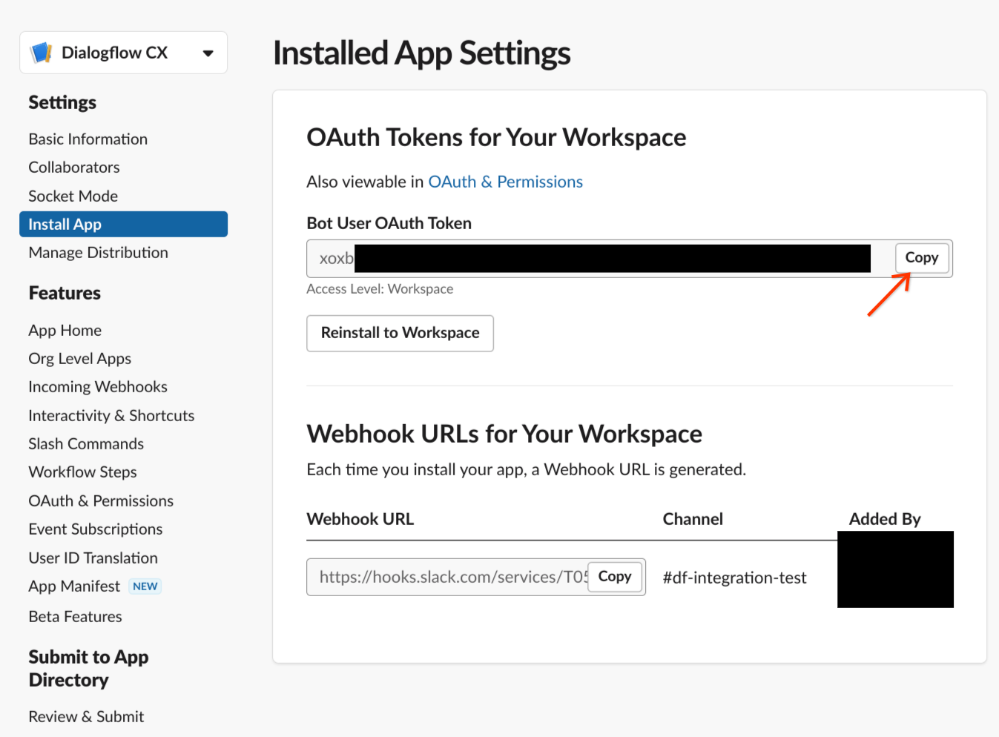 |

### Define Local Environment Variables

Execute the following line in your shell before deploying the integration. This environment variable will be used in the deployment command given in the [primary README](../../README.md).

```sh
INTEGRATION_SECRETS="SLACK_BOT_TOKEN=slack-token:latest,SLACK_SIGNING_SECRET=slack-signing-secret:latest"
```

### Update `.env` Parameters

Update the parameters for your Dialogflow CX agent according to the [primary README](../../README.md).

### Build and Deploy the Integration

Refer to the instructions in the [primary README](../../README.md) for deploying the integration.

### Update Webhook URL

Copy the URL given to you after deploying the app, and update the **Request URL** in found in **Event Subscriptions** with `<GIVEN_URL>/slack/events`.

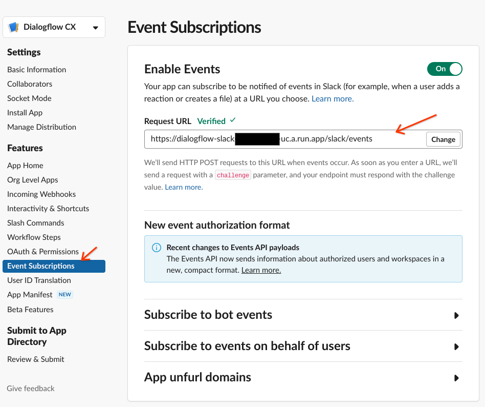

### Configuring Fulfillment Responses

To configure rich responses for Slack you may specify a [custom JSON payload](https://cloud.google.com/dialogflow/cx/docs/concept/fulfillment#payload) according to the format specified by [Slack](https://api.slack.com/messaging/composing/layouts).

If you would like to specify [channel-specific responses](https://cloud.google.com/dialogflow/cx/docs/concept/fulfillment#channel-specific), specify `SLACK` as the channel.

### Testing the Integration

You may chat with the agent by:
- Send a Direct/Instant Message to the bot account
- Install your Slack App to a channel and mention its name in a message in your message (ex: "**@app** hello there!")
    - The bot will reply in a thread, and you will continue needing to mention it (ex: "**@app** good day!") for it to see your message
