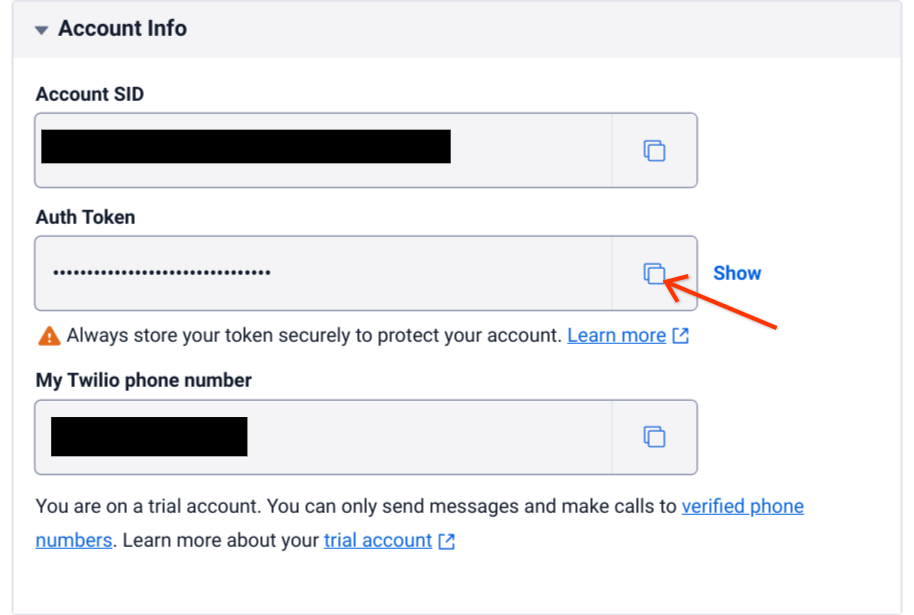
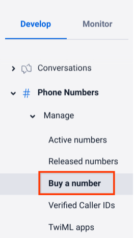
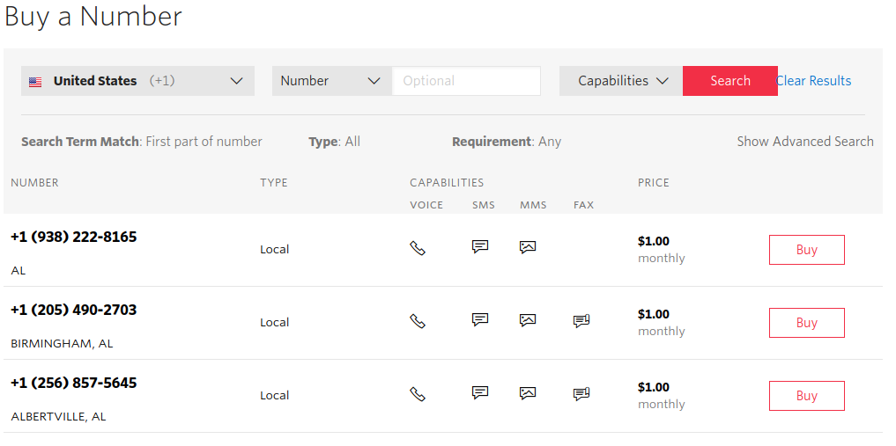
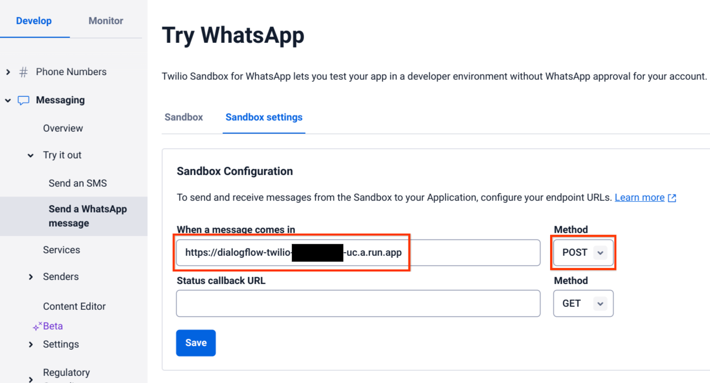

# Twilio Integration for Dialogflow

Bridges your Dialogflow CX or ES agent with Twilio messaging (SMS/MMS and Whatsapp) 

## Prerequisites

- Prerequisites from the [primary README](../../README.md)
- [Twilio account](https://www.twilio.com/try-twilio)

## Setup

Follow the instructions given in the [primary README](../../README.md). These instructions are meant to augment the primary instructions at certain points for Twilio-specific steps.

### Obtain Twilio Credentials

1. Log in to [Twilio Console](https://www.twilio.com/console)
2. Complete the following steps with information found on the **Account Info** section of the dashboard

### Add Secrets to Secret Manager

Refer to the instructions in the [primary README](../../README.md) for creating the following secrets

| Secret Name | Secret Value                                                                              |
|-------------|-------------------------------------------------------------------------------------------|
| twilio-account-sid | **Account SID** <br> |
| twilio-auth-token | **Auth Token** <br>

### Buying a Phone Number

1. Navigate to the Twilio console.
2. Under the **Develop** and **Phone Numbers** tab, expand **Manage**.
3. Select [**Buy a number**](https://www.twilio.com/console/phone-numbers/search).



4. Find a number with SMS capabilities and MMS if you plan to send media.



Additionally, all phone [10DLC numbers](https://support.twilio.com/hc/en-us/articles/360038173654-What-are-the-differences-between-long-codes-A2P-10DLC-short-codes-and-Toll-Free-numbers-for-messaging-to-US-Canada-) will need to be registered with Twilio. If this applies to you, follow [this guide](https://support.twilio.com/hc/en-us/articles/1260801864489-How-do-I-register-to-use-A2P-10DLC-messaging-) to register your new number.

### Define Local Environment Variables

Execute the following line in your shell before deploying the integration. This environment variable will be used in the deployment command given in the [primary README](../../README.md).

```sh
INTEGRATION_SECRETS="TWILIO_ACCOUNT_SID=twilio-account-sid:latest,TWILIO_AUTH_TOKEN=twilio-auth-token:latest"
```

### Update `.env` Parameters

Update the parameters for your Dialogflow CX agent according to the [primary README](../../README.md).

### Build and Deploy the Integration

Refer to the instructions in the [primary README](../../README.md) for deploying the integration.

### Update Webhook URL

1. Copy the URL given to you after deploying the app
2. Under **Phone Numbers**, select **Active numbers**
3. Select the number you would like to use for this integration
4. Select the **Configuration** tab
5. Configure **A message comes in** to use **HTTP POST** and use the **URL** given when deploying the app


### Configuring Fulfillment Responses

#### Dialogflow CX

To configure media responses in Twilio you may specify a [custom JSON payload](https://cloud.google.com/dialogflow/cx/docs/concept/fulfillment#payload). The format for this response is `{"body": "message body text", "media": "https://example.com/example.png"}`

If you would like to specify [channel-specific responses](https://cloud.google.com/dialogflow/cx/docs/concept/fulfillment#channel-specific), specify `TWILIO` as the channel.

#### Dialogflow ES

To configure media responses for Twilio you may specify a [JSON payload](https://cloud.google.com/dialogflow/es/docs/intents-rich-messages#custom). To add a media response, specify a response under the `twilio` parameter in the payload JSON. For example, `{"twilio": {"body": "message body text", "media": "https://example.com/example.png"}}`.

### Testing the Integration

You may chat with the agent by sending an SMS message to the number you purchased earlier.

### WhatsApp Setup

This integration can be used as a webhook with Twilio to send WhatsApp messages.

1. Under **Messaging** and **Try it out**, select **Send a WhatsApp message**
2. Follow the prompts to join the sandbox
3. Select the **Sandbox settings** tab
4. Fill **When a message comes in** with the webhook URL given during deployment and select **POST** for the **Method**



5. Select **Save**
6. Send a message to your WhatsApp number to test the integration.
