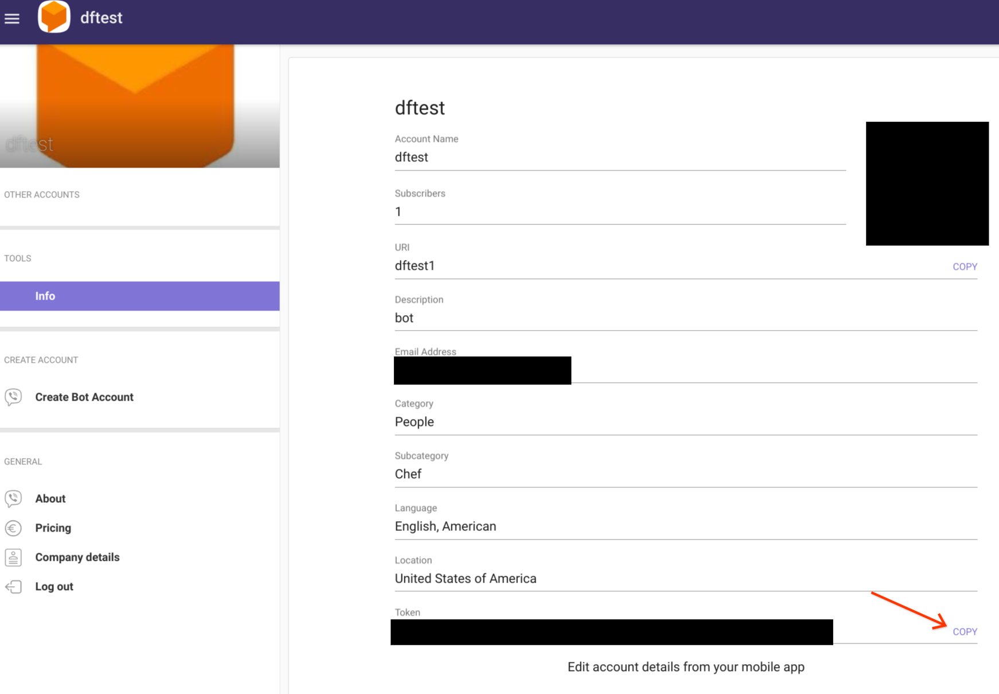

# Viber Integration for Dialogflow

Bridges your Dialogflow CX or ES agent with a Viber bot. 

## Prerequisites

- Prerequisites from the [primary README](../../README.md)
- Viber account and app installed on your mobile device
- Viber [bot account](https://partners.viber.com/)

## Setup

Follow the instructions given in the [primary README](../../README.md). These instructions are meant to augment the primary instructions at certain points for Viber-specific steps.

### Obtain Viber Credentials

1. Log in to your [bot account](https://partners.viber.com/)
2. Complete the following steps with information found on the **Info** page for your bot

### Add Secrets to Secret Manager

Refer to the instructions in the [primary README](../../README.md) for creating the following secrets

| Secret Name | Secret Value                                                                              |
|-------------|-------------------------------------------------------------------------------------------|
| viber-token | **Token** <br> |

### Define Local Environment Variables

Execute the following line in your shell before deploying the integration. This environment variable will be used in the deployment command given in the [primary README](../../README.md).

```sh
INTEGRATION_SECRETS="VIBER_TOKEN=viber-token:latest"
```

### Update `.env` Parameters

Update the parameters for your Dialogflow agent according to the [primary README](../../README.md).

| `.env` Parameter | Parameter Value                    |
|------------------|------------------------------------|
| `BOT_NAME`       | **Account Name**                   |
| `BOT_AVATAR`     | The URI for the bot's avatar image |

### Build and Deploy the Integration

Refer to the instructions in the [primary README](../../README.md) for deploying the integration.

### Update Webhook URL

1. Copy the URL given to you after deploying the app, and update the `WEBHOOK_URL` parameter in `.env` to the given url.
2. You will need to repeat the build and deploy commands to update this parameter. After redeploying the integration, the bot should accept messages.

### Configuring Fulfillment Responses

#### Dialogflow CX

To configure rich responses for Viber you may specify a [custom JSON payload](https://cloud.google.com/dialogflow/cx/docs/concept/fulfillment#payload) according to the format specified by [Viber](https://developers.viber.com/docs/api/rest-bot-api/#message-types).

If you would like to specify [channel-specific responses](https://cloud.google.com/dialogflow/cx/docs/concept/fulfillment#channel-specific), specify `VIBER` as the channel.

#### Dialogflow ES

To configure rich responses for Viber you may specify a [rich response message](https://cloud.google.com/dialogflow/es/docs/intents-rich-messages). You can choose one of the existing message types or choose to customize a [JSON payload](https://cloud.google.com/dialogflow/es/docs/intents-rich-messages#custom) according to the format specified by [Viber](https://developers.viber.com/docs/api/rest-bot-api/#message-types) under the `viber` parameter of the payload.

### Configuring `VIBER_WELCOME` event

#### Dialogflow CX

1. Add an [event handler](https://cloud.google.com/dialogflow/cx/docs/concept/handler#event) to the start page of your agent
2. Select **Use custom event** and enter `VIBER_WELCOME` as the event name
3. Configure the fulfillment as desired
4. Test the welcome message by starting a conversation with the bot

#### Dialogflow ES

1. Create an intent or add an event to an existing intent
2. Under **Events**, type **VIBER_WELCOME** into the **Add event** field.
3. Configure the fulfillment as desired
4. Test the welcome message by starting a conversation with the bot

### Testing the Integration

You may chat with the agent by adding the bot through the QR code and messaging it.
