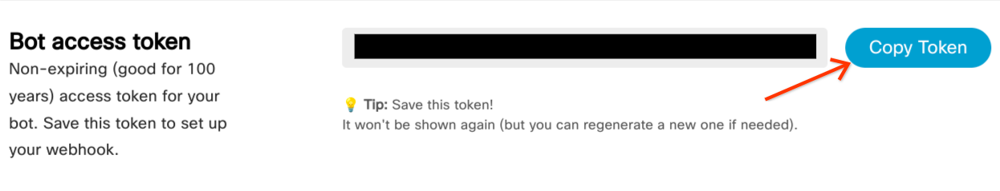

# Webex Integration for Dialogflow

Bridges your Dialogflow CX or ES agent with Webex messaging

## Prerequisites

- Prerequisites from the [primary README](../../README.md)
- [Webex account](https://teams.webex.com/signin)

## Setup

Follow the instructions given in the [primary README](../../README.md). These instructions are meant to augment the primary instructions at certain points for Webex-specific steps.

### Create Webex Bot

1. Log in to Webex and navigate to the [New Bot page](https://developer.webex.com/my-apps/new/bot)
2. Fill the required fields as desired for configuring your bot


3. Complete the following steps with information found after creating the bot.

### Add Secrets to Secret Manager

Refer to the instructions in the [primary README](../../README.md) for creating the following secrets

| Secret Name | Secret Value                                                                              |
|-------------|-------------------------------------------------------------------------------------------|
| webex-access-token | **Account SID** <br> |

### Define Local Environment Variables

Execute the following line in your shell before deploying the integration. This environment variable will be used in the deployment command given in the [primary README](../../README.md).

```sh
INTEGRATION_SECRETS="WEBEX_ACCESS_TOKEN=webex-access-token:latest"
```

### Update `.env` Parameters

Update the parameters for your Dialogflow CX agent according to the [primary README](../../README.md).

### Build and Deploy the Integration

Refer to the instructions in the [primary README](../../README.md) for deploying the integration.

### Update Webhook URL

1. Copy the URL given to you after deploying the app, and update the `WEBHOOK_URL` parameter in `.env` to the given url.
2. You will need to repeat the build and deploy commands to update this parameter. After redeploying the integration, the bot should accept messages.

### Configuring Fulfillment Responses

#### Dialogflow CX

To configure media responses in Webex you may specify a [custom JSON payload](https://cloud.google.com/dialogflow/cx/docs/concept/fulfillment#payload) according to the format specified by [Webex](https://developer.webex.com/docs/api/v1/messages/create-a-message). For example, `{"markdown": "# Heading Text"}`

If you would like to specify [channel-specific responses](https://cloud.google.com/dialogflow/cx/docs/concept/fulfillment#channel-specific), specify `WEBEX` as the channel.

#### Dialogflow ES

To configure media responses for Webex you may specify a [JSON payload](https://cloud.google.com/dialogflow/es/docs/intents-rich-messages#custom) according to the format specified by [Webex](https://developer.webex.com/docs/api/v1/messages/create-a-message). To add a media response, specify a response under the `webex` parameter in the payload JSON. For example, `{"webex": {"markdown": "# Heading Text"}}`.

### Testing the Integration

Navigate to [Webex](https://web.webex.com). You may chat with the agent by:
- Send a Direct Message to the bot account (the username should end with `@webex.bot`)
- Install your Webex App to a channel and mention its name in a message in your message (ex: "**@app** hello there!")
    - The bot will reply in a thread, and you will continue needing to mention it (ex: "**@app** good day!") for it to see your message
