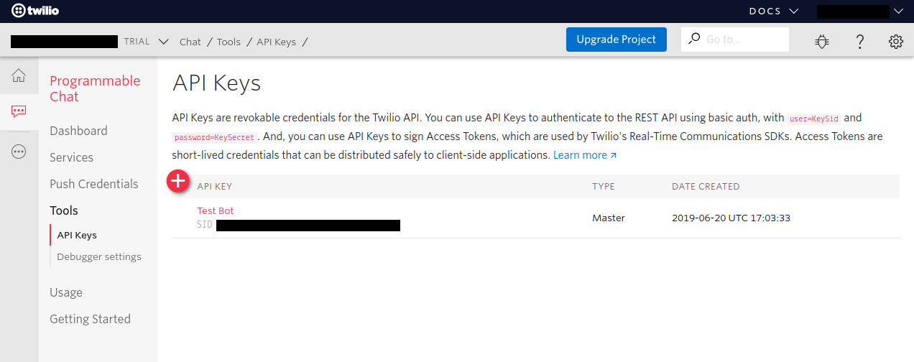
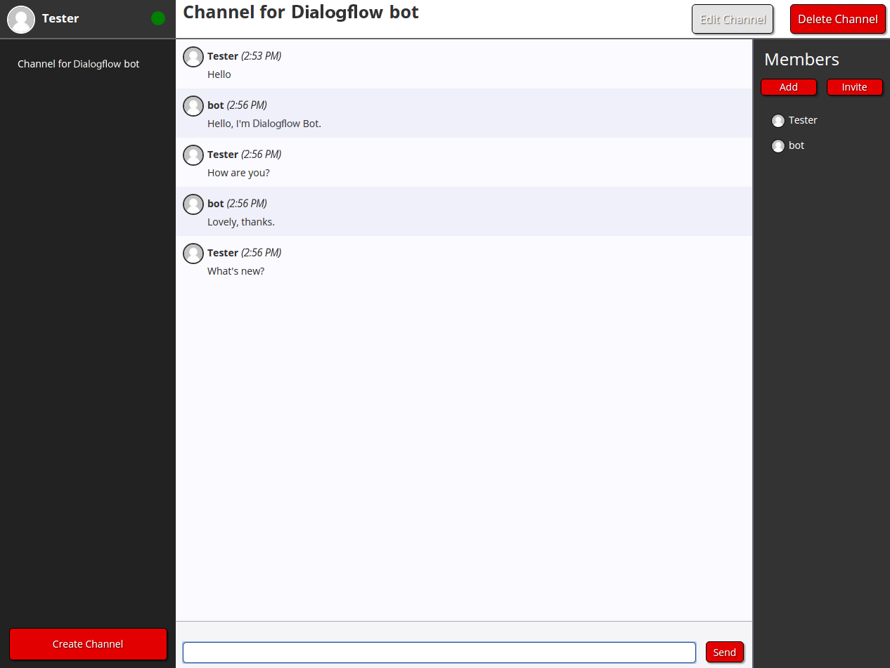

# Twilio IP Integration

## Setup

### Prerequisites

- Follow the instructions on the [main README file](https://github.com/GoogleCloudPlatform/dialogflow-integrations#readme) in the root directory of this repository.
- Create a [Twilio account](https://www.twilio.com/try-twilio).
- Replace the value of __projectId__ in the [server.js file](https://github.com/GoogleCloudPlatform/dialogflow-integrations/blob/03676af04840c21c12e2590393d5542602591bee/twilio-ip/server.js#L30) with your Dialogflow agent’s Project ID.

### Retrieving Credentials

1. Log in to the [Twilio Dashboard](https://www.twilio.com/console).
2. Using the dropdown menu on the top left, select or create the Project to use for this integration. 
2. Under the "Project Info" section, take the value for __Account SID__ and replace the value for __accountSid__ in the [server.js file](https://github.com/GoogleCloudPlatform/dialogflow-integrations/blob/03676af04840c21c12e2590393d5542602591bee/twilio-ip/server.js#L31).
3. Proceed to the [Programmable Chat Dashboard](https://www.twilio.com/console/chat/dashboard) via the navigation menu.
4. Click on the plus button to create a new chat service and enter a new name in the pop-up. 
5. On the next screen, take the value for __Service SID__ and replace the value for __serviceSid__ in the [server.js file](https://github.com/GoogleCloudPlatform/dialogflow-integrations/blob/03676af04840c21c12e2590393d5542602591bee/twilio-ip/server.js#L34).
6. Go to the [Tools tab](https://www.twilio.com/console/chat/project/api-keys) from the navigation menu in the Programmable Chat Dashboard and create a new API key. 
7. On the next page enter a name and continue. 
8. On the following page, take the values for __SID__ and __SECRET__ and replace the values for __apiKey__ and __apiSecret__ in the [server.js file](https://github.com/GoogleCloudPlatform/dialogflow-integrations/blob/03676af04840c21c12e2590393d5542602591bee/twilio-ip/server.js#L32-L33) respectively.



### Deploying the Integration Using Cloud Run

In your local terminal, change the active directory to the repository’s root directory.

Run the following command to save the state of your repository into [GCP Container Registry](https://console.cloud.google.com/gcr/). Replace PROJECT-ID with your agent’s GCP Project ID and PLATFORM with the platform subdirectory name.

```shell
gcloud builds submit --tag gcr.io/PROJECT-ID/dialogflow-PLATFORM
```

Deploy your integration to live using the following command. Replace PROJECT-ID with your agent’s GCP project Id, PLATFORM with the platform subdirectory name, and YOUR_KEY_FILE with the name (not path) of your Service Account JSON key file.

```shell
gcloud beta run deploy --image gcr.io/PROJECT-ID/dialogflow-PLATFORM --update-env-vars GOOGLE_APPLICATION_CREDENTIALS=YOUR_KEY_FILE --memory 1Gi
```

- When prompted for a target platform, select a platform by entering the corresponding number (for example, ``1`` for ``Cloud Run (fully managed)``).
 - When prompted for a region, select a region (for example, ``us-central1``).
 - When prompted for a service name hit enter to accept the default.
 - When prompted to allow unauthenticated invocations press ``y``.
 - Copy the URL given to you, and use it according to the README file in the
 given integration's folder.

More information can be found in Cloud Run
[documentation](https://cloud.google.com/run/docs/deploying).

You can view a list of your active integration deployments under [Cloud Run](https://console.cloud.google.com/run) in the GCP Console.

## Testing

After you have fully set up your Twilio-IP integration deployment, you can test it via the following steps:

1. Download the
[IP Messaging Demo Application](https://github.com/twilio/ip-messaging-demo-js) and unzip it.
2. Open the unzipped folder and make a copy of "credentials.example.json".
3. Rename the file to "credentials.json" and enter the following info:
     * __accountSid__ - This is your __Account SID__
     * __signingKeySid__ - This is your __API Key SID__
     * __signingKeySecret__ - This is your __API Secret__
     * __serviceSid__ - This is your __Service Instance SID__

4. In the terminal, change directory to the unzipped folder and run the following commands:
    * ``npm install``
    * ``npm start``
5. Go to http://localhost:8080 in your browser, enter a name, and click the __Log in As Guest__ button.
6. Click __Channel for Dialogflow__ bot on the left and then start talking to your agent.



## Known Issues

If this integration is stuck during the setup process in Cloud Run, [deploy the container image created for Cloud Run on Google's Kubernetes Engine](https://console.cloud.google.com/kubernetes/workload/deploy). Add the environmental variable __GOOGLE_APPLICATION_CREDENTIALS__ to the service account JSON key file.  Next, go to the [Workloads](https://console.cloud.google.com/kubernetes/workload) tab, and  click on your newly created workload. Click the "Edit" button and set the __replicas__ value to 1 in the YAML file. 
