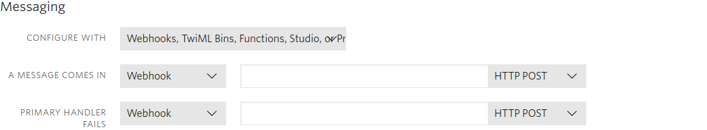

# Twilio Integration

## Setup

### Prerequisites

In order, to setup this integration, you must do the following first:
- Create a [Twilio account](https://www.twilio.com/try-twilio)
- Clone the [git repo](https://OUR_GIT_REPO)

### Retrieving Credentials

Login to the Twilio [Dashboard](https://www.twilio.com/console). Under Project
Info, you should see your __Account SID__ and __Auth Token__. Copy both of these
and add them to server.js in the twilio folder. To add them properly, set the
constants __accountSid__ and __authToken__ to their respective values.

### Buying a Phone Number

Navigate to the Twilio console. Then click on the __"All product and services"__
button and navigate to Phone Numbers. Then in the menu click
[Buy a Number](https://www.twilio.com/console/phone-numbers/search). Search for
number that has SMS capabilities, and proceed to buy it. Add this number to
server.js in the twilio folder as the phoneNumber constant. Make sure to include
the "+" at the beginning of the number.

### Setup Phone Number

In the phone number section go to
[Active numbers](https://www.twilio.com/console/phone-numbers/incoming). Click
on the number you purchased. Underneath messaging, add your server's URL to the
__"A message comes in"__ fill-in box. Make sure the first drop down is set to
Webhook and the HTTP method is set to POST. If you are using Google's Cloud Run,
you should be able have gotten your URL after the first deployment. For
instructions on how to deploy, check the main README file.

