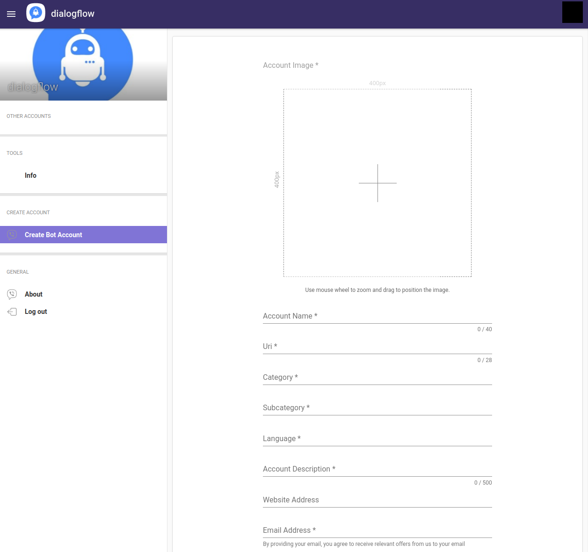

# Viber Integration

## Setup

### Prerequisites

- Follow the instructions on the [main README file](https://github.com/GoogleCloudPlatform/dialogflow-integrations#readme) in the root directory of this repository.
- Download the Viber app on your mobile device and set up account on that device.
- Set up a [bot account](https://partners.viber.com).
- Replace the value of __projectId__ in the [server.js file](https://github.com/GoogleCloudPlatform/dialogflow-integrations/blob/03676af04840c21c12e2590393d5542602591bee/viber/server.js#L34) with your Dialogflow agent’s Project ID.

### Obtaining Viber Credentials

- Log in to your [bot account](https://partners.viber.com). 
- On the main
screen, take the values for __Token__, the URL for your bot’s avatar, and __Account Name__ and replace the values for __viberToken__, __botAvatarLink__, and __botName__ in the [server.js file](https://github.com/GoogleCloudPlatform/dialogflow-integrations/blob/03676af04840c21c12e2590393d5542602591bee/viber/server.js#L35-L37) respectively. 



### Deploying the Integration Using Cloud Run

In your local terminal, change the active directory to the repository’s root directory.

Run the following command to save the state of your repository into [GCP Container Registry](https://console.cloud.google.com/gcr/). Replace PROJECT-ID with your agent’s GCP Project ID and PLATFORM with the platform subdirectory name.

```shell
gcloud builds submit --tag gcr.io/PROJECT-ID/dialogflow-PLATFORM
```

Deploy your integration to live using the following command. Replace PROJECT-ID with your agent’s GCP project Id, PLATFORM with the platform subdirectory name, and YOUR_KEY_FILE with the name (not path) of your Service Account JSON key file.

```shell
gcloud beta run deploy --image gcr.io/PROJECT-ID/dialogflow-PLATFORM --update-env-vars GOOGLE_APPLICATION_CREDENTIALS=YOUR_KEY_FILE --memory 1Gi
```

- When prompted for a target platform, select a platform by entering the corresponding number (for example, ``1`` for ``Cloud Run (fully managed)``).
 - When prompted for a region, select a region (for example, ``us-central1``).
 - When prompted for a service name hit enter to accept the default.
 - When prompted to allow unauthenticated invocations press ``y``.
 - Copy the URL given to you, and use it according to the README file in the
 given integration's folder.

Take the value for the server URL printed in the console after the completion of the execution of the above command and replace the value for __webhookUrl__ in the [server.js file](https://github.com/GoogleCloudPlatform/dialogflow-integrations/blob/03676af04840c21c12e2590393d5542602591bee/viber/server.js#L33). 

Redeploy the integration with the updated change by rerunning the above two commands. 

More information can be found in Cloud Run
[documentation](https://cloud.google.com/run/docs/deploying).

You can view a list of your active integration deployments under [Cloud Run](https://console.cloud.google.com/run) in the GCP Console.
